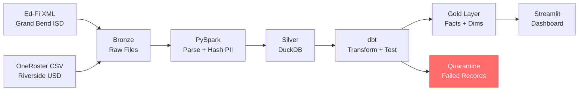

# Ed-Fi Interoperability Lakehouse

**A unified analytics layer for multi-district K-12 data** -- built to demonstrate how
a data platform could ingest messy district data (Ed-Fi XML, OneRoster CSV)
and transform it into reliable, FERPA-compliant analytics.

[Live Demo on Streamlit Cloud](https://ed-filakehouse-oaendihhv7wjec2w2rkhog.streamlit.app/)

---

## The Problem

School districts send data in different formats with different conventions:
- **Grand Bend ISD** uses Ed-Fi XML: student IDs like `STU-00042`, grades as `"First grade"`
- **Riverside USD** uses OneRoster CSV: UUIDs for IDs, grades as `"01"`

Both contain PII (names, emails, birth dates) that must be protected under FERPA.
Data quality issues are inevitable: invalid school references, future enrollment dates,
null student IDs.

## The Solution



A Medallion Architecture that:
- **Ingests** both Ed-Fi XML and OneRoster CSV via PySpark
- **Hashes PII** (SHA-256) at the Silver layer -- no raw names reach analytics
- **Unifies** semantic gaps (`"Ninth grade"` / `"09"` / `"Freshman"` --> `9`)
- **Validates** every record against 10 custom DQ gates before it reaches Gold
- **Quarantines** bad records with full context (rule, field, value, expected)
- **Surfaces** mastery analytics, misconception detection, and early warning flags

## What You'll See in the Demo

| Tab | What It Shows |
|-----|---------------|
| **Classroom Insights** | Mastery heatmap (Kiddom's "max value" method), misconception clustering, standards dependency chains, early warning flags |
| **District Intelligence** | Cross-district benchmarking, curriculum version A/B effectiveness analysis |
| **Data Quality Simulator** | **Interactive** -- inject bad data and watch DQ gates catch it in real-time |
| **Pipeline & Governance** | DQ scorecard, PII compliance panel, data lineage diagram |

## Key Technical Highlights

### Kiddom's "Max Value" Mastery

The highest score a student achieves on a standard is their mastery level.
This matches Kiddom's standards-based grading philosophy.

```sql
-- from fact_student_mastery_daily.sql
max(score) over (
    partition by student_id, standard_code
    order by assessment_date
    rows between unbounded preceding and current row
) as max_score_to_date
```

Mastery levels are then derived:

```sql
case
    when max_score_to_date >= 90 then 'Exceeding'
    when max_score_to_date >= 70 then 'Meeting'
    when max_score_to_date >= 50 then 'Developing'
    else 'Needs Intervention'
end as mastery_level
```

### Semantic Gap Resolution

A dbt macro normalizes grade levels across district formats:

```sql
-- from macros/normalize_grade_level.sql
case
    when lower(raw_grade) in ('ninth grade', 'freshman') then 9  -- Ed-Fi
    when raw_grade ~ '^[0-9]+$' then cast(raw_grade as integer) -- OneRoster
end
```

### PII Protection (FERPA Compliance)

- SHA-256 hashing of names and emails at the Silver layer via PySpark
- Birth dates generalized to birth year only
- Original PII columns are dropped -- never reach the analytics layer
- Verified by `test_pii_masked_in_gold` dbt test that queries `information_schema.columns`

```python
# from spark_jobs/hash_pii.py
df = df.withColumn(f"{name_col}_hash", sha2(col(name_col).cast("string"), 256))
df = df.withColumn("birth_year", year(col(birth_date_col).cast("date")))
df = df.drop(*columns_to_drop)  # drop original PII
```

### Early Warning System

Combines mastery trends with attendance rates to flag at-risk students:

```sql
case
    when count_below_developing >= 3 and attendance_rate < 0.90 then 'High'
    when count_below_developing >= 2 or attendance_rate < 0.90 then 'Medium'
    else 'Low'
end as risk_level
```

## Tech Stack

| Component | Tool | Why |
|-----------|------|-----|
| Raw Parsing | PySpark 3.5 | XML/CSV parsing at scale, built-in PII hashing functions |
| Transformations | dbt (dbt-duckdb 1.9) | SQL-based, testable, documented lineage |
| Warehouse | DuckDB 1.2 | Snowflake-compatible SQL, zero infrastructure cost |
| Orchestration | Apache Airflow | DAG-based pipeline scheduling and monitoring |
| Frontend | Streamlit 1.41 | Interactive analytics dashboard with Plotly charts |
| Data Quality | 10 custom dbt tests | K-12 business rule validation with quarantine routing |
| Data Generation | Faker + lxml | Realistic synthetic K-12 data for 2 districts |

## Project Structure

```
ED-FI_lakehouse/
├── data_generation/               # Synthetic data generators
│   ├── generate_edfi_xml.py       # Ed-Fi XML for Grand Bend ISD (10 entity types)
│   ├── generate_oneroster_csv.py  # OneRoster CSV for Riverside USD (9 entity types)
│   ├── reference_data.py          # Schools, standards, misconception patterns
│   └── write_seeds.py             # Export reference data as dbt seeds
├── spark_jobs/                    # PySpark Bronze → Silver
│   ├── parse_edfi_xml.py          # XML parser (10 entity types)
│   ├── parse_oneroster_csv.py     # CSV parser (9 entity types)
│   ├── hash_pii.py                # SHA-256 PII hashing
│   ├── load_to_duckdb.py          # Silver layer loader
│   └── run_bronze_to_silver.py    # End-to-end runner
├── dbt_project/                   # dbt Silver → Gold
│   ├── models/staging/            # 19 staging views (10 Ed-Fi + 9 OneRoster)
│   ├── models/intermediate/       # 9 unified views (cross-source)
│   ├── models/marts/              # 11 Gold tables (facts, dims, aggregates)
│   ├── tests/                     # 10 custom DQ tests
│   ├── macros/                    # normalize_grade_level, etc.
│   └── seeds/                     # Reference data (schools, standards, misconceptions)
├── streamlit_app/                 # Analytics dashboard
│   ├── app.py                     # Main app (4 tabs)
│   ├── db.py                      # DuckDB connection helper
│   └── tabs/                      # Tab implementations
│       ├── classroom_insights.py  # Mastery heatmap, misconceptions, early warning
│       ├── district_intelligence.py # Cross-district benchmarking
│       ├── dq_simulator.py        # Interactive DQ gate testing
│       └── pipeline_governance.py # DQ scorecard, PII compliance, lineage
├── dags/                          # Airflow pipeline DAGs
│   └── edfi_lakehouse_pipeline.py # Full pipeline DAG
├── tests/                         # Python unit tests
├── docs/plans/                    # Design & implementation docs
├── docker-compose.yml             # Airflow local environment
└── requirements.txt               # Python dependencies
```

## Run Locally

**Prerequisites:** Python 3.11, Java 8+ (for PySpark)

```bash
# Clone and setup
git clone <repo-url> && cd ED-FI_lakehouse
python -m venv .venv && source .venv/bin/activate
pip install -r requirements.txt

# Generate synthetic data
python -c "from data_generation.generate_edfi_xml import generate_edfi_district; generate_edfi_district('data/bronze/edfi', num_students=5000)"
python -c "from data_generation.generate_oneroster_csv import generate_oneroster_district; generate_oneroster_district('data/bronze/oneroster', num_students=3500)"

# Run Bronze → Silver pipeline (PySpark)
python -m spark_jobs.run_bronze_to_silver

# Run Silver → Gold transformations (dbt)
cd dbt_project && dbt seed && dbt run && dbt test && cd ..

# Copy database for Streamlit
cp data/lakehouse.duckdb streamlit_app/data/lakehouse.duckdb

# Launch dashboard
cd streamlit_app && streamlit run app.py
```

## Data Quality Gates

| # | Test | What It Catches |
|---|------|----------------|
| 1 | `test_valid_school_id` | Enrollment references non-existent school |
| 2 | `test_grade_level_course_match` | Student grade level outside school's grade band |
| 3 | `test_enrollment_date_not_future` | Enrollment dates in the future |
| 4 | `test_section_exists_for_enrollment` | School has enrollments but no sections |
| 5 | `test_student_id_not_null` | Missing student identifiers |
| 6 | `test_pii_masked_in_gold` | Raw PII columns in Gold layer |
| 7 | `test_attendance_rate_bounds` | Attendance rates outside 0-100% |
| 8 | `test_max_value_mastery` | Mastery score decreasing (violates max-value rule) |
| 9 | `test_no_duplicate_students` | Duplicate student records per source |
| 10 | `test_answer_exists_for_scored_assessment` | Scored assessments missing answer data |

Records that fail gates 1, 3, and 5 are routed to `fact_dq_quarantine_log` with full context
(rule name, field, offending value, expected value) instead of silently dropped.

## Design Decisions

See [`docs/plans/2026-03-03-edfi-lakehouse-design.md`](docs/plans/2026-03-03-edfi-lakehouse-design.md) for the full design document, including:
- Why DuckDB over Postgres/Snowflake for a portfolio project
- The tradeoff between PySpark and dbt for PII hashing
- How misconception patterns were modeled from wrong-answer distributions
- Quarantine-vs-reject strategy for data quality failures
