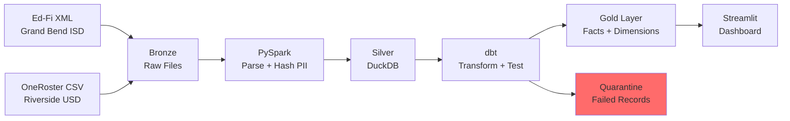

# Ed-Fi Interoperability Lakehouse — Implementation Plan

> **For Claude:** REQUIRED SUB-SKILL: Use superpowers:executing-plans to implement this plan task-by-task.

**Goal:** Build a portfolio project demonstrating a unified K-12 analytics lakehouse that ingests Ed-Fi XML and OneRoster CSV, transforms via PySpark + dbt into a medallion architecture, and presents insights through a published Streamlit app — targeting the Kiddom Senior Data Engineer role.

**Architecture:** Local-first, cloud-ready. PySpark parses raw files (Bronze → Silver), dbt transforms business logic (Silver → Gold) in DuckDB, Streamlit reads a bundled DuckDB file on Streamlit Community Cloud. Airflow orchestrates the pipeline locally via Docker Compose.

**Tech Stack:** Python 3.11, PySpark, dbt-duckdb, DuckDB, Airflow, Streamlit, Docker Compose

**Design Doc:** `docs/plans/2026-03-03-edfi-lakehouse-design.md`

**Timeline:** 1-2 weeks, 5 phases, 20 tasks

---

## Phase Overview

| Phase | Days | Tasks | What Gets Built |
|-------|------|-------|-----------------|
| 1. Foundation + Data Generation | 1-3 | 1-4 | Project setup, mock data generators, reference seeds |
| 2. PySpark Parsing | 3-5 | 5-7 | Bronze → Silver parsing, PII hashing, DuckDB load |
| 3. dbt Transformations | 5-8 | 8-12 | Staging, intermediate, marts, DQ gates |
| 4. Streamlit App | 8-12 | 13-17 | All 4 tabs + sidebar |
| 5. Deploy & Polish | 12-14 | 18-20 | Airflow DAGs, README, Streamlit Cloud deploy |

---

## Phase 1: Foundation + Data Generation (Days 1-3)

### Task 1: Project Setup

**Files:**
- Create: `pyproject.toml`
- Create: `requirements.txt`
- Create: `.gitignore`
- Create: `.python-version`
- Create: `data_generation/__init__.py`
- Create: `spark_jobs/__init__.py`
- Create: `streamlit_app/__init__.py`
- Create: `tests/__init__.py`
- Create: `tests/test_data_generation/__init__.py`
- Create: `tests/test_spark_jobs/__init__.py`

**Step 1: Create `.gitignore`**

```gitignore
# Python
__pycache__/
*.py[cod]
*.egg-info/
.venv/
venv/

# Data (large files — only samples committed)
data/bronze/
data/silver/
data/gold/
!data/bronze/.gitkeep
!data/silver/.gitkeep
!data/gold/.gitkeep

# DuckDB (the bundled one for Streamlit goes in streamlit_app/data/)
*.duckdb
*.duckdb.wal
!streamlit_app/data/lakehouse.duckdb

# IDE
.vscode/
.idea/

# Airflow
airflow/logs/
airflow/airflow.db

# OS
.DS_Store

# Terraform
.terraform/
*.tfstate*
```

**Step 2: Create `.python-version`**

```
3.11
```

**Step 3: Create `pyproject.toml`**

```toml
[project]
name = "edfi-lakehouse"
version = "0.1.0"
description = "Ed-Fi Interoperability Lakehouse — Kiddom Portfolio Project"
requires-python = ">=3.11"

[tool.pytest.ini_options]
testpaths = ["tests"]
pythonpath = ["."]
```

**Step 4: Create `requirements.txt`**

```
# Data Generation
faker==33.0.0
lxml==5.3.0

# Spark
pyspark==3.5.4

# dbt
dbt-duckdb==1.9.1

# Streamlit App
streamlit==1.41.0
duckdb==1.2.0
plotly==6.0.0
streamlit-agraph==0.0.45
graphviz==0.20.3

# Testing
pytest==8.3.4
```

**Step 5: Create virtual environment and install**

Run: `python3.11 -m venv .venv && source .venv/bin/activate && pip install -r requirements.txt`
Expected: Clean install, no errors.

**Step 6: Create directory structure**

Run:
```bash
mkdir -p data/bronze/edfi data/bronze/oneroster data/silver data/gold
mkdir -p data_generation spark_jobs dags streamlit_app/tabs streamlit_app/components streamlit_app/data
mkdir -p dbt_project/models/staging/edfi dbt_project/models/staging/oneroster
mkdir -p dbt_project/models/intermediate dbt_project/models/marts
mkdir -p dbt_project/tests dbt_project/macros dbt_project/seeds
mkdir -p tests/test_data_generation tests/test_spark_jobs
touch data/bronze/.gitkeep data/silver/.gitkeep data/gold/.gitkeep
touch data_generation/__init__.py spark_jobs/__init__.py tests/__init__.py
touch tests/test_data_generation/__init__.py tests/test_spark_jobs/__init__.py
```

**Step 7: Commit**

```bash
git add .gitignore .python-version pyproject.toml requirements.txt
git add data/ data_generation/ spark_jobs/ dbt_project/ streamlit_app/ dags/ tests/
git commit -m "feat: initialize project structure and dependencies"
```

---

### Task 2: Reference Data Seeds

These are the static lookup tables that everything else references. Build these first because the data generators need them.

**Files:**
- Create: `dbt_project/seeds/seed_learning_standards.csv`
- Create: `dbt_project/seeds/seed_misconception_patterns.csv`
- Create: `dbt_project/seeds/seed_school_registry.csv`
- Create: `data_generation/reference_data.py`
- Create: `tests/test_data_generation/test_reference_data.py`

**Step 1: Write the test for reference data loader**

```python
# tests/test_data_generation/test_reference_data.py
from data_generation.reference_data import (
    get_learning_standards,
    get_school_registry,
    get_misconception_patterns,
)


def test_learning_standards_has_prerequisite_chains():
    standards = get_learning_standards()
    # Must have at least one standard with a prerequisite
    has_prereq = [s for s in standards if s["prerequisite_standard_code"]]
    assert len(has_prereq) >= 3, "Need at least 3 standards with prerequisites for dependency chain"


def test_learning_standards_cover_grades_k_through_5():
    standards = get_learning_standards()
    grade_levels = {s["grade_level"] for s in standards}
    assert grade_levels >= {0, 1, 2, 3, 4, 5}, "Must cover K-5"


def test_school_registry_has_both_districts():
    schools = get_school_registry()
    districts = {s["district_name"] for s in schools}
    assert "Grand Bend ISD" in districts
    assert "Riverside USD" in districts


def test_school_registry_has_school_types():
    schools = get_school_registry()
    types = {s["school_type"] for s in schools}
    assert types >= {"Elementary", "Middle", "High"}


def test_misconception_patterns_exist():
    patterns = get_misconception_patterns()
    assert len(patterns) >= 3
    codes = {p["standard_code"] for p in patterns}
    assert "CCSS.MATH.4.OA.A.1" in codes
    assert "CCSS.MATH.3.NF.A.1" in codes
    assert "CCSS.MATH.4.NF.B.3" in codes
```

**Step 2: Run test to verify it fails**

Run: `pytest tests/test_data_generation/test_reference_data.py -v`
Expected: FAIL — `ModuleNotFoundError: No module named 'data_generation.reference_data'`

**Step 3: Write `data_generation/reference_data.py`**

```python
# data_generation/reference_data.py
"""
Static reference data for the Ed-Fi Lakehouse.
These define the schools, learning standards, and misconception patterns
that the data generators and dbt seeds use.
"""


def get_school_registry() -> list[dict]:
    """Both districts' schools. This is the authoritative registry
    that DQ gate test_valid_school_id checks against."""
    return [
        # Grand Bend ISD (Ed-Fi source) — 8 schools
        {"school_id": "GB-ES-001", "school_name": "Grand Bend Elementary", "school_type": "Elementary", "district_id": "GB-ISD", "district_name": "Grand Bend ISD", "source_system": "edfi", "grade_band_low": 0, "grade_band_high": 5},
        {"school_id": "GB-ES-002", "school_name": "Lakeview Elementary", "school_type": "Elementary", "district_id": "GB-ISD", "district_name": "Grand Bend ISD", "source_system": "edfi", "grade_band_low": 0, "grade_band_high": 5},
        {"school_id": "GB-ES-003", "school_name": "Pinewood Elementary", "school_type": "Elementary", "district_id": "GB-ISD", "district_name": "Grand Bend ISD", "source_system": "edfi", "grade_band_low": 0, "grade_band_high": 5},
        {"school_id": "GB-ES-004", "school_name": "Riverside Elementary", "school_type": "Elementary", "district_id": "GB-ISD", "district_name": "Grand Bend ISD", "source_system": "edfi", "grade_band_low": 0, "grade_band_high": 5},
        {"school_id": "GB-ES-005", "school_name": "Oakdale Elementary", "school_type": "Elementary", "district_id": "GB-ISD", "district_name": "Grand Bend ISD", "source_system": "edfi", "grade_band_low": 0, "grade_band_high": 5},
        {"school_id": "GB-MS-001", "school_name": "Grand Bend Middle School", "school_type": "Middle", "district_id": "GB-ISD", "district_name": "Grand Bend ISD", "source_system": "edfi", "grade_band_low": 6, "grade_band_high": 8},
        {"school_id": "GB-MS-002", "school_name": "Lakeshore Middle School", "school_type": "Middle", "district_id": "GB-ISD", "district_name": "Grand Bend ISD", "source_system": "edfi", "grade_band_low": 6, "grade_band_high": 8},
        {"school_id": "GB-HS-001", "school_name": "Grand Bend High School", "school_type": "High", "district_id": "GB-ISD", "district_name": "Grand Bend ISD", "source_system": "edfi", "grade_band_low": 9, "grade_band_high": 12},
        # Riverside USD (OneRoster source) — 6 schools
        {"school_id": "RV-ES-001", "school_name": "Riverside Elementary", "school_type": "Elementary", "district_id": "RV-USD", "district_name": "Riverside USD", "source_system": "oneroster", "grade_band_low": 0, "grade_band_high": 5},
        {"school_id": "RV-ES-002", "school_name": "Valley View Elementary", "school_type": "Elementary", "district_id": "RV-USD", "district_name": "Riverside USD", "source_system": "oneroster", "grade_band_low": 0, "grade_band_high": 5},
        {"school_id": "RV-ES-003", "school_name": "Hilltop Elementary", "school_type": "Elementary", "district_id": "RV-USD", "district_name": "Riverside USD", "source_system": "oneroster", "grade_band_low": 0, "grade_band_high": 5},
        {"school_id": "RV-ES-004", "school_name": "Sunnydale Elementary", "school_type": "Elementary", "district_id": "RV-USD", "district_name": "Riverside USD", "source_system": "oneroster", "grade_band_low": 0, "grade_band_high": 5},
        {"school_id": "RV-MS-001", "school_name": "Riverside Middle School", "school_type": "Middle", "district_id": "RV-USD", "district_name": "Riverside USD", "source_system": "oneroster", "grade_band_low": 6, "grade_band_high": 8},
        {"school_id": "RV-HS-001", "school_name": "Riverside High School", "school_type": "High", "district_id": "RV-USD", "district_name": "Riverside USD", "source_system": "oneroster", "grade_band_low": 9, "grade_band_high": 12},
    ]


def get_learning_standards() -> list[dict]:
    """CCSS Math standards K-5 with prerequisite chains.
    The prerequisite_standard_code enables the Standards Dependency Chain visualization."""
    return [
        # Kindergarten — Counting & Cardinality
        {"standard_code": "CCSS.MATH.K.CC.A.1", "standard_description": "Count to 100 by ones and by tens", "domain": "Counting & Cardinality", "grade_level": 0, "prerequisite_standard_code": ""},
        {"standard_code": "CCSS.MATH.K.CC.B.4", "standard_description": "Understand the relationship between numbers and quantities", "domain": "Counting & Cardinality", "grade_level": 0, "prerequisite_standard_code": "CCSS.MATH.K.CC.A.1"},
        {"standard_code": "CCSS.MATH.K.OA.A.1", "standard_description": "Represent addition and subtraction with objects", "domain": "Operations & Algebraic Thinking", "grade_level": 0, "prerequisite_standard_code": "CCSS.MATH.K.CC.B.4"},
        # Grade 1 — Operations & Algebraic Thinking
        {"standard_code": "CCSS.MATH.1.OA.A.1", "standard_description": "Use addition and subtraction within 20 to solve word problems", "domain": "Operations & Algebraic Thinking", "grade_level": 1, "prerequisite_standard_code": "CCSS.MATH.K.OA.A.1"},
        {"standard_code": "CCSS.MATH.1.OA.B.3", "standard_description": "Apply properties of operations as strategies to add and subtract", "domain": "Operations & Algebraic Thinking", "grade_level": 1, "prerequisite_standard_code": "CCSS.MATH.1.OA.A.1"},
        {"standard_code": "CCSS.MATH.1.NBT.B.2", "standard_description": "Understand that the two digits of a two-digit number represent amounts of tens and ones", "domain": "Number & Operations in Base Ten", "grade_level": 1, "prerequisite_standard_code": "CCSS.MATH.K.CC.A.1"},
        # Grade 2 — Operations & Algebraic Thinking / NBT
        {"standard_code": "CCSS.MATH.2.OA.A.1", "standard_description": "Use addition and subtraction within 100 to solve one- and two-step word problems", "domain": "Operations & Algebraic Thinking", "grade_level": 2, "prerequisite_standard_code": "CCSS.MATH.1.OA.A.1"},
        {"standard_code": "CCSS.MATH.2.OA.B.2", "standard_description": "Fluently add and subtract within 20", "domain": "Operations & Algebraic Thinking", "grade_level": 2, "prerequisite_standard_code": "CCSS.MATH.1.OA.B.3"},
        {"standard_code": "CCSS.MATH.2.NBT.A.1", "standard_description": "Understand that the three digits of a three-digit number represent hundreds, tens, and ones", "domain": "Number & Operations in Base Ten", "grade_level": 2, "prerequisite_standard_code": "CCSS.MATH.1.NBT.B.2"},
        # Grade 3 — Fractions (the critical prerequisite chain)
        {"standard_code": "CCSS.MATH.3.OA.A.1", "standard_description": "Interpret products of whole numbers", "domain": "Operations & Algebraic Thinking", "grade_level": 3, "prerequisite_standard_code": "CCSS.MATH.2.OA.A.1"},
        {"standard_code": "CCSS.MATH.3.OA.A.3", "standard_description": "Use multiplication and division within 100 to solve word problems", "domain": "Operations & Algebraic Thinking", "grade_level": 3, "prerequisite_standard_code": "CCSS.MATH.3.OA.A.1"},
        {"standard_code": "CCSS.MATH.3.NF.A.1", "standard_description": "Understand a fraction 1/b as the quantity formed by 1 part when a whole is partitioned into b equal parts", "domain": "Number & Operations—Fractions", "grade_level": 3, "prerequisite_standard_code": "CCSS.MATH.2.NBT.A.1"},
        {"standard_code": "CCSS.MATH.3.NF.A.2", "standard_description": "Understand a fraction as a number on the number line", "domain": "Number & Operations—Fractions", "grade_level": 3, "prerequisite_standard_code": "CCSS.MATH.3.NF.A.1"},
        {"standard_code": "CCSS.MATH.3.NF.A.3", "standard_description": "Explain equivalence of fractions and compare fractions", "domain": "Number & Operations—Fractions", "grade_level": 3, "prerequisite_standard_code": "CCSS.MATH.3.NF.A.2"},
        # Grade 4 — The misconception-heavy standards
        {"standard_code": "CCSS.MATH.4.OA.A.1", "standard_description": "Interpret a multiplication equation as a comparison", "domain": "Operations & Algebraic Thinking", "grade_level": 4, "prerequisite_standard_code": "CCSS.MATH.3.OA.A.3"},
        {"standard_code": "CCSS.MATH.4.OA.A.2", "standard_description": "Multiply or divide to solve word problems involving multiplicative comparison", "domain": "Operations & Algebraic Thinking", "grade_level": 4, "prerequisite_standard_code": "CCSS.MATH.4.OA.A.1"},
        {"standard_code": "CCSS.MATH.4.NF.A.1", "standard_description": "Explain why a fraction a/b is equivalent to (n×a)/(n×b)", "domain": "Number & Operations—Fractions", "grade_level": 4, "prerequisite_standard_code": "CCSS.MATH.3.NF.A.3"},
        {"standard_code": "CCSS.MATH.4.NF.B.3", "standard_description": "Understand a fraction a/b with a > 1 as a sum of fractions 1/b", "domain": "Number & Operations—Fractions", "grade_level": 4, "prerequisite_standard_code": "CCSS.MATH.4.NF.A.1"},
        {"standard_code": "CCSS.MATH.4.NF.B.4", "standard_description": "Apply and extend previous understandings of multiplication to multiply a fraction by a whole number", "domain": "Number & Operations—Fractions", "grade_level": 4, "prerequisite_standard_code": "CCSS.MATH.4.NF.B.3"},
        # Grade 5 — Building on fractions
        {"standard_code": "CCSS.MATH.5.NF.A.1", "standard_description": "Add and subtract fractions with unlike denominators", "domain": "Number & Operations—Fractions", "grade_level": 5, "prerequisite_standard_code": "CCSS.MATH.4.NF.B.3"},
        {"standard_code": "CCSS.MATH.5.NF.A.2", "standard_description": "Solve word problems involving addition and subtraction of fractions", "domain": "Number & Operations—Fractions", "grade_level": 5, "prerequisite_standard_code": "CCSS.MATH.5.NF.A.1"},
        {"standard_code": "CCSS.MATH.5.NF.B.3", "standard_description": "Interpret a fraction as division of the numerator by the denominator", "domain": "Number & Operations—Fractions", "grade_level": 5, "prerequisite_standard_code": "CCSS.MATH.5.NF.A.1"},
        {"standard_code": "CCSS.MATH.5.OA.A.1", "standard_description": "Use parentheses, brackets, or braces in numerical expressions", "domain": "Operations & Algebraic Thinking", "grade_level": 5, "prerequisite_standard_code": "CCSS.MATH.4.OA.A.2"},
    ]


def get_misconception_patterns() -> list[dict]:
    """Known misconception patterns planted in the assessment data.
    These mirror what Kiddom Atlas detects."""
    return [
        {
            "misconception_id": "MC-001",
            "standard_code": "CCSS.MATH.4.OA.A.1",
            "pattern_label": "subtraction_instead_of_division",
            "description": "Students confuse 'how many fewer' (subtraction) with 'how many times' (division) in multiplicative comparison problems",
            "suggested_reteach": "IM Unit 4, Lesson 7 — Multiplicative vs. Additive Comparison",
            "wrong_answer_pattern": "subtract",  # used by generator to plant wrong answers
        },
        {
            "misconception_id": "MC-002",
            "standard_code": "CCSS.MATH.3.NF.A.1",
            "pattern_label": "numerator_denominator_swap",
            "description": "Students confuse which number represents the parts taken (numerator) vs. total parts (denominator)",
            "suggested_reteach": "IM Unit 5, Lesson 3 — Parts of a Whole",
            "wrong_answer_pattern": "swap_fraction",
        },
        {
            "misconception_id": "MC-003",
            "standard_code": "CCSS.MATH.4.NF.B.3",
            "pattern_label": "fraction_addition_whole_number",
            "description": "Students add both numerators and denominators (e.g., 1/3 + 1/4 = 2/7) instead of finding common denominators",
            "suggested_reteach": "IM Unit 6, Lesson 2 — Adding Fractions with Unlike Denominators",
            "wrong_answer_pattern": "add_both",
        },
        {
            "misconception_id": "MC-004",
            "standard_code": "CCSS.MATH.5.NF.B.3",
            "pattern_label": "fraction_division_invert_wrong",
            "description": "Students invert the dividend instead of the divisor when dividing fractions",
            "suggested_reteach": "IM Unit 4, Lesson 10 — Dividing with Fractions",
            "wrong_answer_pattern": "invert_wrong",
        },
    ]
```

**Step 4: Run test to verify it passes**

Run: `pytest tests/test_data_generation/test_reference_data.py -v`
Expected: All 5 tests PASS.

**Step 5: Write the dbt seed CSVs**

Generate from the reference data:

```python
# Run this as a one-time script to write seed CSVs
# python -c "from data_generation.reference_data import *; ..."
# Or just create the CSVs directly — they are committed to the repo.
```

Create `dbt_project/seeds/seed_learning_standards.csv` — CSV with columns: `standard_code,standard_description,domain,grade_level,prerequisite_standard_code`

Create `dbt_project/seeds/seed_misconception_patterns.csv` — CSV with columns: `misconception_id,standard_code,pattern_label,description,suggested_reteach`

Create `dbt_project/seeds/seed_school_registry.csv` — CSV with columns: `school_id,school_name,school_type,district_id,district_name,source_system,grade_band_low,grade_band_high`

**Step 6: Commit**

```bash
git add data_generation/reference_data.py tests/test_data_generation/test_reference_data.py
git add dbt_project/seeds/
git commit -m "feat: add reference data (standards, schools, misconception patterns)"
```

---

### Task 3: Ed-Fi XML Data Generator

**Files:**
- Create: `data_generation/generate_edfi_xml.py`
- Create: `tests/test_data_generation/test_generate_edfi.py`

**Step 1: Write the test**

```python
# tests/test_data_generation/test_generate_edfi.py
import os
import xml.etree.ElementTree as ET
from data_generation.generate_edfi_xml import generate_edfi_district


def test_generates_all_required_files(tmp_path):
    generate_edfi_district(output_dir=str(tmp_path), num_students=50)
    expected_files = [
        "Students.xml", "Schools.xml", "Staff.xml", "Sections.xml",
        "StudentSchoolAssociations.xml", "StudentSectionAssociations.xml",
        "Grades.xml", "StudentAssessments.xml",
        "StudentSchoolAttendanceEvents.xml", "LearningStandards.xml",
    ]
    for f in expected_files:
        assert (tmp_path / f).exists(), f"Missing {f}"


def test_students_xml_has_correct_structure(tmp_path):
    generate_edfi_district(output_dir=str(tmp_path), num_students=10)
    tree = ET.parse(tmp_path / "Students.xml")
    root = tree.getroot()
    students = root.findall(".//Student")
    assert len(students) == 10
    # Each student must have required fields
    for s in students:
        assert s.find("StudentUniqueId") is not None
        assert s.find("FirstName") is not None
        assert s.find("LastSurname") is not None
        assert s.find("BirthDate") is not None
        assert s.find("Email") is not None


def test_planted_dq_issues_exist(tmp_path):
    generate_edfi_district(output_dir=str(tmp_path), num_students=100)
    # Should have some invalid school IDs
    tree = ET.parse(tmp_path / "StudentSchoolAssociations.xml")
    root = tree.getroot()
    school_ids = [e.find("SchoolId").text for e in root.findall(".//StudentSchoolAssociation")]
    invalid = [sid for sid in school_ids if sid.startswith("INVALID")]
    assert len(invalid) >= 3, "Must have planted invalid SchoolIDs"


def test_assessment_responses_have_misconceptions(tmp_path):
    generate_edfi_district(output_dir=str(tmp_path), num_students=100)
    tree = ET.parse(tmp_path / "StudentAssessments.xml")
    root = tree.getroot()
    # Check that some responses have misconception-pattern answers
    items = root.findall(".//StudentAssessmentItem")
    assert len(items) > 0, "Must have item-level assessment responses"
```

**Step 2: Run test to verify it fails**

Run: `pytest tests/test_data_generation/test_generate_edfi.py -v`
Expected: FAIL — import error.

**Step 3: Implement `data_generation/generate_edfi_xml.py`**

This is a substantial file. Key behaviors:
- Uses `faker` for realistic names/dates
- References `reference_data.py` for schools, standards, misconceptions
- Generates nested Ed-Fi XML matching the Ed-Fi Data Standard v5 schema
- Plants DQ issues: invalid SchoolIDs (~5%), grade-level violations (~3%), future dates (~2%), null student_ids (~2%), dangling section refs (~2%)
- Plants misconception patterns in assessment item responses
- Accepts `num_students` param for configurable volume
- Creates relationally consistent data: students → enrollments → sections → grades → assessments

The generator must:
1. Create schools from registry
2. Create `num_students` students with realistic demographics
3. Assign students to schools (with some invalid assignments for DQ)
4. Create sections per school (math courses for each grade band)
5. Create student-section associations
6. Generate attendance events (180 school days, ~93% attendance rate average)
7. Generate assessment results with item-level responses (planting misconception patterns)
8. Generate grades per grading period

Each XML file follows Ed-Fi interchange format:
```xml
<InterchangeStudentEnrollment xmlns="http://ed-fi.org/0220">
  <StudentSchoolAssociation>
    <StudentReference><StudentUniqueId>STU-001</StudentUniqueId></StudentReference>
    <SchoolReference><SchoolId>GB-ES-001</SchoolId></SchoolReference>
    <EntryDate>2025-08-15</EntryDate>
    <EntryGradeLevelDescriptor>First grade</EntryGradeLevelDescriptor>
  </StudentSchoolAssociation>
</InterchangeStudentEnrollment>
```

**Step 4: Run tests to verify they pass**

Run: `pytest tests/test_data_generation/test_generate_edfi.py -v`
Expected: All 4 tests PASS.

**Step 5: Generate full dataset**

Run: `python -c "from data_generation.generate_edfi_xml import generate_edfi_district; generate_edfi_district('data/bronze/edfi', num_students=5000)"`
Expected: 10 XML files in `data/bronze/edfi/`, total ~50-100MB.

**Step 6: Commit**

```bash
git add data_generation/generate_edfi_xml.py tests/test_data_generation/test_generate_edfi.py
git commit -m "feat: add Ed-Fi XML data generator with planted DQ issues and misconceptions"
```

---

### Task 4: OneRoster CSV Data Generator

**Files:**
- Create: `data_generation/generate_oneroster_csv.py`
- Create: `tests/test_data_generation/test_generate_oneroster.py`

**Step 1: Write the test**

```python
# tests/test_data_generation/test_generate_oneroster.py
import csv
from data_generation.generate_oneroster_csv import generate_oneroster_district


def test_generates_all_required_files(tmp_path):
    generate_oneroster_district(output_dir=str(tmp_path), num_students=50)
    expected_files = [
        "orgs.csv", "users.csv", "classes.csv", "courses.csv",
        "enrollments.csv", "academicSessions.csv",
        "lineItems.csv", "results.csv", "demographics.csv",
    ]
    for f in expected_files:
        assert (tmp_path / f).exists(), f"Missing {f}"


def test_users_csv_has_correct_headers(tmp_path):
    generate_oneroster_district(output_dir=str(tmp_path), num_students=10)
    with open(tmp_path / "users.csv") as f:
        reader = csv.DictReader(f)
        headers = reader.fieldnames
        assert "sourcedId" in headers
        assert "givenName" in headers
        assert "familyName" in headers
        assert "email" in headers


def test_enrollments_reference_valid_users_and_classes(tmp_path):
    generate_oneroster_district(output_dir=str(tmp_path), num_students=50)
    with open(tmp_path / "users.csv") as f:
        user_ids = {row["sourcedId"] for row in csv.DictReader(f)}
    with open(tmp_path / "classes.csv") as f:
        class_ids = {row["sourcedId"] for row in csv.DictReader(f)}
    with open(tmp_path / "enrollments.csv") as f:
        for row in csv.DictReader(f):
            # Most should be valid (except planted DQ issues)
            if not row["userSourcedId"].startswith("INVALID"):
                assert row["userSourcedId"] in user_ids
            if not row["classSourcedId"].startswith("INVALID"):
                assert row["classSourcedId"] in class_ids


def test_results_have_item_level_data(tmp_path):
    generate_oneroster_district(output_dir=str(tmp_path), num_students=50)
    with open(tmp_path / "results.csv") as f:
        results = list(csv.DictReader(f))
    assert len(results) > 0
    # Check that score field exists and is populated
    for r in results[:10]:
        assert r["score"] != ""


def test_planted_dq_issues_in_oneroster(tmp_path):
    generate_oneroster_district(output_dir=str(tmp_path), num_students=100)
    with open(tmp_path / "enrollments.csv") as f:
        enrollments = list(csv.DictReader(f))
    # Should have some dangling references
    with open(tmp_path / "classes.csv") as f:
        valid_classes = {row["sourcedId"] for row in csv.DictReader(f)}
    dangling = [e for e in enrollments if e["classSourcedId"] not in valid_classes]
    assert len(dangling) >= 2, "Must have planted dangling class references"
```

**Step 2: Run test to verify it fails**

Run: `pytest tests/test_data_generation/test_generate_oneroster.py -v`
Expected: FAIL — import error.

**Step 3: Implement `data_generation/generate_oneroster_csv.py`**

Key behaviors:
- Generates OneRoster 1.2 compliant CSVs with correct headers and column order
- References `reference_data.py` for Riverside USD schools
- Uses `sourcedId` GUIDs for all IDs
- Generates `users.csv` with both students (role=student) and teachers (role=teacher)
- Uses different naming conventions than Ed-Fi (this IS the semantic gap)
  - Grade levels as `"09"` format (vs Ed-Fi's `"Ninth grade"`)
  - Dates in ISO 8601 format
  - Roles explicit in enrollments
- Plants similar DQ issues: dangling refs, future dates, null fields
- Plants misconception patterns in `results.csv` item-level data
- Assigns curriculum_version "A" or "B" to different sections (for curriculum effectiveness analysis)

**Step 4: Run tests**

Run: `pytest tests/test_data_generation/test_generate_oneroster.py -v`
Expected: All 5 tests PASS.

**Step 5: Generate full dataset**

Run: `python -c "from data_generation.generate_oneroster_csv import generate_oneroster_district; generate_oneroster_district('data/bronze/oneroster', num_students=3500)"`
Expected: 9 CSV files in `data/bronze/oneroster/`.

**Step 6: Commit**

```bash
git add data_generation/generate_oneroster_csv.py tests/test_data_generation/test_generate_oneroster.py
git commit -m "feat: add OneRoster CSV data generator with planted DQ issues"
```

---

## Phase 2: PySpark Parsing (Days 3-5)

### Task 5: PySpark Ed-Fi XML Parser

**Files:**
- Create: `spark_jobs/parse_edfi_xml.py`
- Create: `tests/test_spark_jobs/test_parse_edfi.py`

**Step 1: Write the test**

```python
# tests/test_spark_jobs/test_parse_edfi.py
import os
import pytest
from pyspark.sql import SparkSession
from data_generation.generate_edfi_xml import generate_edfi_district


@pytest.fixture(scope="module")
def spark():
    session = (
        SparkSession.builder
        .master("local[*]")
        .appName("test_parse_edfi")
        .getOrCreate()
    )
    yield session
    session.stop()


@pytest.fixture(scope="module")
def edfi_data(tmp_path_factory):
    path = str(tmp_path_factory.mktemp("edfi"))
    generate_edfi_district(output_dir=path, num_students=50)
    return path


def test_parse_students_returns_flat_dataframe(spark, edfi_data):
    from spark_jobs.parse_edfi_xml import parse_students
    df = parse_students(spark, edfi_data)
    assert df.count() == 50
    expected_cols = {"student_unique_id", "first_name", "last_name", "birth_date", "email"}
    assert expected_cols.issubset(set(df.columns))


def test_parse_enrollments_returns_flat_dataframe(spark, edfi_data):
    from spark_jobs.parse_edfi_xml import parse_enrollments
    df = parse_enrollments(spark, edfi_data)
    assert df.count() > 0
    expected_cols = {"student_unique_id", "school_id", "entry_date", "grade_level_descriptor"}
    assert expected_cols.issubset(set(df.columns))


def test_parse_assessments_has_item_responses(spark, edfi_data):
    from spark_jobs.parse_edfi_xml import parse_assessment_results
    df = parse_assessment_results(spark, edfi_data)
    assert df.count() > 0
    expected_cols = {"student_unique_id", "assessment_id", "question_number", "standard_code", "correct_answer", "student_answer"}
    assert expected_cols.issubset(set(df.columns))


def test_parse_attendance_returns_daily_events(spark, edfi_data):
    from spark_jobs.parse_edfi_xml import parse_attendance
    df = parse_attendance(spark, edfi_data)
    assert df.count() > 0
    expected_cols = {"student_unique_id", "school_id", "event_date", "attendance_status"}
    assert expected_cols.issubset(set(df.columns))


def test_all_dataframes_have_source_system_column(spark, edfi_data):
    from spark_jobs.parse_edfi_xml import parse_students, parse_enrollments
    for parse_fn in [parse_students, parse_enrollments]:
        df = parse_fn(spark, edfi_data)
        assert "_source_system" in df.columns
        values = [row._source_system for row in df.select("_source_system").distinct().collect()]
        assert values == ["edfi"]
```

**Step 2: Run test to verify it fails**

Run: `pytest tests/test_spark_jobs/test_parse_edfi.py -v`
Expected: FAIL — import error.

**Step 3: Implement `spark_jobs/parse_edfi_xml.py`**

Key behaviors:
- Each `parse_*` function takes a `SparkSession` and `input_dir` path
- Reads XML files using Python `xml.etree.ElementTree` (collect to driver for demo scale — note in comments that production would use `spark-xml` package for distributed parsing)
- Flattens nested Ed-Fi XML into flat rows
- Adds `_source_system = "edfi"` column to every DataFrame
- Adds `_loaded_at` timestamp column
- Returns PySpark DataFrames
- Has a `run_all(spark, input_dir, output_dir)` function that:
  1. Parses all entity types
  2. Writes each as Parquet to `output_dir`

Functions to implement:
- `parse_students(spark, input_dir) -> DataFrame`
- `parse_schools(spark, input_dir) -> DataFrame`
- `parse_staff(spark, input_dir) -> DataFrame`
- `parse_sections(spark, input_dir) -> DataFrame`
- `parse_enrollments(spark, input_dir) -> DataFrame`
- `parse_section_associations(spark, input_dir) -> DataFrame`
- `parse_grades(spark, input_dir) -> DataFrame`
- `parse_assessment_results(spark, input_dir) -> DataFrame`
- `parse_attendance(spark, input_dir) -> DataFrame`
- `parse_standards(spark, input_dir) -> DataFrame`
- `run_all(spark, input_dir, output_dir) -> None`

**Step 4: Run tests**

Run: `pytest tests/test_spark_jobs/test_parse_edfi.py -v`
Expected: All 5 tests PASS.

**Step 5: Commit**

```bash
git add spark_jobs/parse_edfi_xml.py tests/test_spark_jobs/test_parse_edfi.py
git commit -m "feat: add PySpark Ed-Fi XML parser (Bronze → Parquet)"
```

---

### Task 6: PySpark OneRoster CSV Parser + PII Hashing

**Files:**
- Create: `spark_jobs/parse_oneroster_csv.py`
- Create: `spark_jobs/hash_pii.py`
- Create: `tests/test_spark_jobs/test_parse_oneroster.py`
- Create: `tests/test_spark_jobs/test_hash_pii.py`

**Step 1: Write the tests**

```python
# tests/test_spark_jobs/test_parse_oneroster.py
import pytest
from pyspark.sql import SparkSession
from data_generation.generate_oneroster_csv import generate_oneroster_district


@pytest.fixture(scope="module")
def spark():
    session = (
        SparkSession.builder
        .master("local[*]")
        .appName("test_parse_oneroster")
        .getOrCreate()
    )
    yield session
    session.stop()


@pytest.fixture(scope="module")
def oneroster_data(tmp_path_factory):
    path = str(tmp_path_factory.mktemp("oneroster"))
    generate_oneroster_district(output_dir=path, num_students=50)
    return path


def test_parse_users_returns_flat_dataframe(spark, oneroster_data):
    from spark_jobs.parse_oneroster_csv import parse_users
    df = parse_users(spark, oneroster_data)
    assert df.count() > 50  # students + teachers
    expected_cols = {"sourced_id", "given_name", "family_name", "email", "role"}
    assert expected_cols.issubset(set(df.columns))


def test_parse_enrollments_has_correct_roles(spark, oneroster_data):
    from spark_jobs.parse_oneroster_csv import parse_enrollments
    df = parse_enrollments(spark, oneroster_data)
    roles = {row.role for row in df.select("role").distinct().collect()}
    assert "student" in roles
    assert "teacher" in roles


def test_parse_results_has_score_data(spark, oneroster_data):
    from spark_jobs.parse_oneroster_csv import parse_results
    df = parse_results(spark, oneroster_data)
    assert df.count() > 0
    assert "score" in df.columns
    assert "line_item_sourced_id" in df.columns


def test_all_dataframes_have_source_system_column(spark, oneroster_data):
    from spark_jobs.parse_oneroster_csv import parse_users
    df = parse_users(spark, oneroster_data)
    assert "_source_system" in df.columns
    values = [row._source_system for row in df.select("_source_system").distinct().collect()]
    assert values == ["oneroster"]
```

```python
# tests/test_spark_jobs/test_hash_pii.py
import pytest
from pyspark.sql import SparkSession
from pyspark.sql import Row


@pytest.fixture(scope="module")
def spark():
    session = (
        SparkSession.builder
        .master("local[*]")
        .appName("test_hash_pii")
        .getOrCreate()
    )
    yield session
    session.stop()


def test_hash_pii_replaces_name_columns(spark):
    from spark_jobs.hash_pii import hash_pii_columns
    df = spark.createDataFrame([
        Row(student_id="S1", first_name="Maria", last_name="Garcia", email="maria@school.edu", birth_date="2015-03-14"),
    ])
    result = hash_pii_columns(df, name_cols=["first_name", "last_name"], email_col="email", birth_date_col="birth_date")
    # Original PII columns should be gone
    assert "first_name" not in result.columns
    assert "last_name" not in result.columns
    assert "email" not in result.columns
    assert "birth_date" not in result.columns
    # Hashed columns should exist
    assert "student_id_hash" in result.columns or "first_name_hash" in result.columns
    assert "email_hash" in result.columns
    assert "birth_year" in result.columns


def test_hash_is_deterministic(spark):
    from spark_jobs.hash_pii import hash_pii_columns
    df = spark.createDataFrame([
        Row(student_id="S1", first_name="Maria", last_name="Garcia", email="maria@school.edu", birth_date="2015-03-14"),
    ])
    r1 = hash_pii_columns(df, name_cols=["first_name", "last_name"], email_col="email", birth_date_col="birth_date")
    r2 = hash_pii_columns(df, name_cols=["first_name", "last_name"], email_col="email", birth_date_col="birth_date")
    assert r1.collect()[0].email_hash == r2.collect()[0].email_hash


def test_birth_date_generalized_to_year(spark):
    from spark_jobs.hash_pii import hash_pii_columns
    df = spark.createDataFrame([
        Row(student_id="S1", first_name="Maria", last_name="Garcia", email="m@s.edu", birth_date="2015-03-14"),
    ])
    result = hash_pii_columns(df, name_cols=["first_name", "last_name"], email_col="email", birth_date_col="birth_date")
    row = result.collect()[0]
    assert row.birth_year == 2015
```

**Step 2: Run tests to verify they fail**

Run: `pytest tests/test_spark_jobs/test_parse_oneroster.py tests/test_spark_jobs/test_hash_pii.py -v`
Expected: FAIL — import errors.

**Step 3: Implement `spark_jobs/parse_oneroster_csv.py`**

Key behaviors:
- Reads OneRoster CSVs using `spark.read.csv(header=True)`
- Renames columns from OneRoster convention (`sourcedId` → `sourced_id`, `givenName` → `given_name`, etc.)
- Adds `_source_system = "oneroster"` and `_loaded_at`
- Functions: `parse_users`, `parse_orgs`, `parse_classes`, `parse_courses`, `parse_enrollments`, `parse_academic_sessions`, `parse_line_items`, `parse_results`, `parse_demographics`, `run_all`

**Step 4: Implement `spark_jobs/hash_pii.py`**

Key behaviors:
- `hash_pii_columns(df, name_cols, email_col, birth_date_col) -> DataFrame`
- Uses PySpark's `sha2(col, 256)` for hashing
- Drops original PII columns, adds hashed versions
- Generalizes `birth_date` → `birth_year` (extract year only)
- Deterministic — same input always produces same hash

**Step 5: Run tests**

Run: `pytest tests/test_spark_jobs/ -v`
Expected: All tests PASS.

**Step 6: Commit**

```bash
git add spark_jobs/parse_oneroster_csv.py spark_jobs/hash_pii.py
git add tests/test_spark_jobs/test_parse_oneroster.py tests/test_spark_jobs/test_hash_pii.py
git commit -m "feat: add OneRoster CSV parser and PII hashing module"
```

---

### Task 7: Load Parquet into DuckDB Silver

**Files:**
- Create: `spark_jobs/load_to_duckdb.py`
- Create: `tests/test_spark_jobs/test_load_to_duckdb.py`

**Step 1: Write the test**

```python
# tests/test_spark_jobs/test_load_to_duckdb.py
import duckdb
import pytest
from spark_jobs.load_to_duckdb import load_parquet_to_duckdb


def test_loads_parquet_files_as_tables(tmp_path):
    # Create a small parquet file using DuckDB itself
    db_path = str(tmp_path / "test.duckdb")
    parquet_dir = tmp_path / "parquet"
    parquet_dir.mkdir()

    # Write a test parquet
    con = duckdb.connect()
    con.execute(f"COPY (SELECT 1 as id, 'test' as name) TO '{parquet_dir}/test_table.parquet' (FORMAT PARQUET)")
    con.close()

    load_parquet_to_duckdb(
        parquet_dir=str(parquet_dir),
        duckdb_path=db_path,
        schema="silver",
    )

    con = duckdb.connect(db_path, read_only=True)
    result = con.execute("SELECT * FROM silver.test_table").fetchall()
    assert len(result) == 1
    assert result[0] == (1, "test")
    con.close()


def test_creates_schema_if_not_exists(tmp_path):
    db_path = str(tmp_path / "test.duckdb")
    parquet_dir = tmp_path / "parquet"
    parquet_dir.mkdir()

    con = duckdb.connect()
    con.execute(f"COPY (SELECT 1 as id) TO '{parquet_dir}/t.parquet' (FORMAT PARQUET)")
    con.close()

    load_parquet_to_duckdb(str(parquet_dir), db_path, schema="silver")

    con = duckdb.connect(db_path, read_only=True)
    schemas = [r[0] for r in con.execute("SELECT schema_name FROM information_schema.schemata").fetchall()]
    assert "silver" in schemas
    con.close()
```

**Step 2: Run test to verify it fails**

Run: `pytest tests/test_spark_jobs/test_load_to_duckdb.py -v`
Expected: FAIL — import error.

**Step 3: Implement `spark_jobs/load_to_duckdb.py`**

```python
# spark_jobs/load_to_duckdb.py
"""Load Parquet files into DuckDB Silver schema."""
import glob
import os
import duckdb


def load_parquet_to_duckdb(parquet_dir: str, duckdb_path: str, schema: str = "silver") -> None:
    """Load all .parquet files from parquet_dir into DuckDB tables.
    Table name is derived from the parquet filename (without extension)."""
    con = duckdb.connect(duckdb_path)
    con.execute(f"CREATE SCHEMA IF NOT EXISTS {schema}")

    for parquet_file in sorted(glob.glob(os.path.join(parquet_dir, "*.parquet"))):
        table_name = os.path.splitext(os.path.basename(parquet_file))[0]
        con.execute(f"DROP TABLE IF EXISTS {schema}.{table_name}")
        con.execute(f"CREATE TABLE {schema}.{table_name} AS SELECT * FROM read_parquet('{parquet_file}')")
        count = con.execute(f"SELECT COUNT(*) FROM {schema}.{table_name}").fetchone()[0]
        print(f"  Loaded {schema}.{table_name}: {count} rows")

    con.close()
```

**Step 4: Run tests**

Run: `pytest tests/test_spark_jobs/test_load_to_duckdb.py -v`
Expected: All 2 tests PASS.

**Step 5: Create the end-to-end Bronze → Silver runner**

Create: `spark_jobs/run_bronze_to_silver.py`

```python
# spark_jobs/run_bronze_to_silver.py
"""End-to-end runner: parse raw files → hash PII → write Parquet → load DuckDB."""
from pyspark.sql import SparkSession
from spark_jobs.parse_edfi_xml import run_all as run_edfi
from spark_jobs.parse_oneroster_csv import run_all as run_oneroster
from spark_jobs.load_to_duckdb import load_parquet_to_duckdb


def run(
    edfi_input: str = "data/bronze/edfi",
    oneroster_input: str = "data/bronze/oneroster",
    parquet_output: str = "data/silver",
    duckdb_path: str = "data/lakehouse.duckdb",
):
    spark = (
        SparkSession.builder
        .master("local[*]")
        .appName("edfi_lakehouse_bronze_to_silver")
        .getOrCreate()
    )

    print("=== Parsing Ed-Fi XML ===")
    run_edfi(spark, edfi_input, f"{parquet_output}/edfi")

    print("=== Parsing OneRoster CSV ===")
    run_oneroster(spark, oneroster_input, f"{parquet_output}/oneroster")

    spark.stop()

    print("=== Loading into DuckDB Silver ===")
    load_parquet_to_duckdb(f"{parquet_output}/edfi", duckdb_path, schema="silver")
    load_parquet_to_duckdb(f"{parquet_output}/oneroster", duckdb_path, schema="silver")

    print("=== Done ===")


if __name__ == "__main__":
    run()
```

**Step 6: Run the full Bronze → Silver pipeline**

Run: `python -m spark_jobs.run_bronze_to_silver`
Expected: Parquet files in `data/silver/`, DuckDB at `data/lakehouse.duckdb` with `silver.*` tables.

**Step 7: Commit**

```bash
git add spark_jobs/load_to_duckdb.py spark_jobs/run_bronze_to_silver.py
git add tests/test_spark_jobs/test_load_to_duckdb.py
git commit -m "feat: add DuckDB loader and Bronze → Silver runner"
```

---

## Phase 3: dbt Transformations (Days 5-8)

### Task 8: dbt Project Initialization + Staging Models

**Files:**
- Create: `dbt_project/dbt_project.yml`
- Create: `dbt_project/profiles.yml`
- Create: `dbt_project/models/staging/edfi/stg_edfi__students.sql`
- Create: `dbt_project/models/staging/edfi/stg_edfi__schools.sql`
- Create: `dbt_project/models/staging/edfi/stg_edfi__enrollments.sql`
- Create: `dbt_project/models/staging/edfi/stg_edfi__sections.sql`
- Create: `dbt_project/models/staging/edfi/stg_edfi__staff.sql`
- Create: `dbt_project/models/staging/edfi/stg_edfi__grades.sql`
- Create: `dbt_project/models/staging/edfi/stg_edfi__assessments.sql`
- Create: `dbt_project/models/staging/edfi/stg_edfi__attendance.sql`
- Create: `dbt_project/models/staging/edfi/_edfi__sources.yml`
- Create: `dbt_project/models/staging/edfi/_edfi__models.yml`
- Create: `dbt_project/models/staging/oneroster/stg_oneroster__users.sql`
- Create: `dbt_project/models/staging/oneroster/stg_oneroster__orgs.sql`
- Create: `dbt_project/models/staging/oneroster/stg_oneroster__enrollments.sql`
- Create: `dbt_project/models/staging/oneroster/stg_oneroster__classes.sql`
- Create: `dbt_project/models/staging/oneroster/stg_oneroster__courses.sql`
- Create: `dbt_project/models/staging/oneroster/stg_oneroster__results.sql`
- Create: `dbt_project/models/staging/oneroster/stg_oneroster__line_items.sql`
- Create: `dbt_project/models/staging/oneroster/stg_oneroster__academic_sessions.sql`
- Create: `dbt_project/models/staging/oneroster/stg_oneroster__demographics.sql`
- Create: `dbt_project/models/staging/oneroster/_oneroster__sources.yml`
- Create: `dbt_project/models/staging/oneroster/_oneroster__models.yml`

**Step 1: Create `dbt_project/dbt_project.yml`**

```yaml
name: edfi_lakehouse
version: "1.0.0"
config-version: 2

profile: edfi_lakehouse

model-paths: ["models"]
test-paths: ["tests"]
seed-paths: ["seeds"]
macro-paths: ["macros"]

clean-targets:
  - target
  - dbt_packages

models:
  edfi_lakehouse:
    staging:
      +materialized: view
    intermediate:
      +materialized: view
    marts:
      +materialized: table

seeds:
  edfi_lakehouse:
    +schema: reference
```

**Step 2: Create `dbt_project/profiles.yml`**

```yaml
edfi_lakehouse:
  outputs:
    dev:
      type: duckdb
      path: "../data/lakehouse.duckdb"
      schema: gold
      threads: 4
  target: dev
```

**Step 3: Create source definitions**

`dbt_project/models/staging/edfi/_edfi__sources.yml`:
```yaml
version: 2

sources:
  - name: edfi_silver
    schema: silver
    description: "Ed-Fi XML data parsed by PySpark into Silver layer"
    tables:
      - name: students
        description: "Student demographics from Grand Bend ISD"
      - name: schools
        description: "School buildings from Grand Bend ISD"
      - name: enrollments
        description: "Student-school enrollment associations"
      - name: sections
        description: "Class sections"
      - name: section_associations
        description: "Student-section roster assignments"
      - name: staff
        description: "Teacher and staff records"
      - name: grades
        description: "Grading period grades"
      - name: assessment_results
        description: "Assessment item-level responses"
      - name: attendance
        description: "Daily school attendance events"
```

`dbt_project/models/staging/oneroster/_oneroster__sources.yml`:
```yaml
version: 2

sources:
  - name: oneroster_silver
    schema: silver
    description: "OneRoster CSV data parsed by PySpark into Silver layer"
    tables:
      - name: users
        description: "Students and teachers from Riverside USD"
      - name: orgs
        description: "Districts and schools"
      - name: enrollments
        description: "User-class enrollment records"
      - name: classes
        description: "Class sections"
      - name: courses
        description: "Course catalog"
      - name: results
        description: "Assessment scores and item responses"
      - name: line_items
        description: "Assignments and assessments"
      - name: academic_sessions
        description: "Terms and grading periods"
      - name: demographics
        description: "Student demographics"
```

**Step 4: Create Ed-Fi staging models**

Example — `dbt_project/models/staging/edfi/stg_edfi__students.sql`:
```sql
with source as (
    select * from {{ source('edfi_silver', 'students') }}
),

renamed as (
    select
        student_unique_id as student_id,
        first_name,
        last_name,
        email,
        birth_date,
        _source_system,
        _loaded_at
    from source
)

select * from renamed
```

Example — `dbt_project/models/staging/edfi/stg_edfi__enrollments.sql`:
```sql
with source as (
    select * from {{ source('edfi_silver', 'enrollments') }}
),

renamed as (
    select
        student_unique_id as student_id,
        school_id,
        entry_date as enrollment_start_date,
        grade_level_descriptor as grade_level_raw,
        _source_system,
        _loaded_at
    from source
)

select * from renamed
```

Follow same pattern for all Ed-Fi staging models: select from source, rename to common convention, pass through `_source_system` and `_loaded_at`.

**Step 5: Create OneRoster staging models**

Example — `dbt_project/models/staging/oneroster/stg_oneroster__users.sql`:
```sql
with source as (
    select * from {{ source('oneroster_silver', 'users') }}
),

renamed as (
    select
        sourced_id as student_id,
        given_name as first_name,
        family_name as last_name,
        email,
        -- OneRoster has role in users table
        role,
        _source_system,
        _loaded_at
    from source
    where role = 'student'  -- filter students only for this model
)

select * from renamed
```

Follow same pattern for all OneRoster staging models.

**Step 6: Create model YAML docs with standard dbt tests**

`dbt_project/models/staging/edfi/_edfi__models.yml`:
```yaml
version: 2

models:
  - name: stg_edfi__students
    description: "Staged student records from Grand Bend ISD (Ed-Fi)"
    columns:
      - name: student_id
        description: "Student unique identifier"
        tests:
          - not_null
          - unique
      - name: first_name
        tests:
          - not_null
      - name: last_name
        tests:
          - not_null

  - name: stg_edfi__enrollments
    description: "Staged enrollment records from Grand Bend ISD"
    columns:
      - name: student_id
        tests:
          - not_null
      - name: school_id
        tests:
          - not_null
      - name: enrollment_start_date
        tests:
          - not_null
```

Repeat for OneRoster models.

**Step 7: Run dbt to verify staging models compile**

Run: `cd dbt_project && dbt debug && dbt run --select staging && dbt test --select staging`
Expected: Models compile, views created, standard tests pass (some may fail on planted DQ issues — that's expected and validates the DQ gates work).

**Step 8: Commit**

```bash
git add dbt_project/
git commit -m "feat: add dbt project with staging models for Ed-Fi and OneRoster"
```

---

### Task 9: dbt Intermediate Models (Cross-Source Unification)

**Files:**
- Create: `dbt_project/models/intermediate/int_students.sql`
- Create: `dbt_project/models/intermediate/int_schools.sql`
- Create: `dbt_project/models/intermediate/int_enrollments.sql`
- Create: `dbt_project/models/intermediate/int_sections.sql`
- Create: `dbt_project/models/intermediate/int_staff.sql`
- Create: `dbt_project/models/intermediate/int_grades.sql`
- Create: `dbt_project/models/intermediate/int_assessments.sql`
- Create: `dbt_project/models/intermediate/int_attendance.sql`
- Create: `dbt_project/models/intermediate/int_standards.sql`
- Create: `dbt_project/models/intermediate/_int__models.yml`
- Create: `dbt_project/macros/normalize_grade_level.sql`

**Step 1: Create the grade level normalization macro**

`dbt_project/macros/normalize_grade_level.sql`:
```sql

    case
        -- Ed-Fi descriptors
        when lower({{ raw_grade_col }}) in ('kindergarten', 'k', 'pk') then 0
        when lower({{ raw_grade_col }}) = 'first grade' then 1
        when lower({{ raw_grade_col }}) = 'second grade' then 2
        when lower({{ raw_grade_col }}) = 'third grade' then 3
        when lower({{ raw_grade_col }}) = 'fourth grade' then 4
        when lower({{ raw_grade_col }}) = 'fifth grade' then 5
        when lower({{ raw_grade_col }}) = 'sixth grade' then 6
        when lower({{ raw_grade_col }}) = 'seventh grade' then 7
        when lower({{ raw_grade_col }}) = 'eighth grade' then 8
        when lower({{ raw_grade_col }}) in ('ninth grade', 'freshman') then 9
        when lower({{ raw_grade_col }}) in ('tenth grade', 'sophomore') then 10
        when lower({{ raw_grade_col }}) in ('eleventh grade', 'junior') then 11
        when lower({{ raw_grade_col }}) in ('twelfth grade', 'senior') then 12
        -- OneRoster numeric formats
        when {{ raw_grade_col }} ~ '^\d+$' then cast({{ raw_grade_col }} as integer)
        when {{ raw_grade_col }} ~ '^\d{2}$' then cast({{ raw_grade_col }} as integer)
        else null
    end

```

**Step 2: Create intermediate models**

`dbt_project/models/intermediate/int_students.sql`:
```sql
with edfi_students as (
    select
        student_id,
        first_name,
        last_name,
        email,
        birth_date,
        _source_system
    from {{ ref('stg_edfi__students') }}
),

oneroster_students as (
    select
        student_id,
        first_name,
        last_name,
        email,
        null as birth_date,  -- birth_date comes from demographics.csv
        _source_system
    from {{ ref('stg_oneroster__users') }}
),

unified as (
    select * from edfi_students
    union all
    select * from oneroster_students
)

select * from unified
```

`dbt_project/models/intermediate/int_enrollments.sql`:
```sql
with edfi_enrollments as (
    select
        student_id,
        school_id,
        enrollment_start_date,
        {{ normalize_grade_level('grade_level_raw') }} as grade_level,
        _source_system
    from {{ ref('stg_edfi__enrollments') }}
),

oneroster_enrollments as (
    select
        e.user_sourced_id as student_id,
        e.school_sourced_id as school_id,
        e.begin_date as enrollment_start_date,
        {{ normalize_grade_level('c.grades') }} as grade_level,
        e._source_system
    from {{ ref('stg_oneroster__enrollments') }} e
    left join {{ ref('stg_oneroster__classes') }} c
        on e.class_sourced_id = c.sourced_id
    where e.role = 'student'
),

unified as (
    select * from edfi_enrollments
    union all
    select * from oneroster_enrollments
)

select * from unified
```

`dbt_project/models/intermediate/int_standards.sql`:
```sql
-- Standards come from the seed, not from source data
select
    standard_code,
    standard_description,
    domain,
    grade_level,
    prerequisite_standard_code
from {{ ref('seed_learning_standards') }}
```

Follow same union-all pattern for other intermediate models: `int_schools`, `int_sections`, `int_staff`, `int_grades`, `int_assessments`, `int_attendance`.

**Step 3: Create model YAML with tests**

`dbt_project/models/intermediate/_int__models.yml` — document each model, add relationship tests (e.g., `int_enrollments.school_id` references `int_schools.school_id`).

**Step 4: Run dbt**

Run: `cd dbt_project && dbt run --select intermediate && dbt test --select intermediate`
Expected: Models build, most tests pass. Some relationship tests may flag planted DQ issues.

**Step 5: Commit**

```bash
git add dbt_project/models/intermediate/ dbt_project/macros/
git commit -m "feat: add intermediate models for cross-source unification"
```

---

### Task 10: dbt Mart Models (Gold Layer)

**Files:**
- Create: `dbt_project/models/marts/fact_student_mastery_daily.sql`
- Create: `dbt_project/models/marts/fact_assessment_responses.sql`
- Create: `dbt_project/models/marts/fact_dq_quarantine_log.sql`
- Create: `dbt_project/models/marts/fact_attendance_daily.sql`
- Create: `dbt_project/models/marts/dim_student.sql`
- Create: `dbt_project/models/marts/dim_school.sql`
- Create: `dbt_project/models/marts/dim_standard.sql`
- Create: `dbt_project/models/marts/dim_section.sql`
- Create: `dbt_project/models/marts/dim_misconception_pattern.sql`
- Create: `dbt_project/models/marts/agg_early_warning.sql`
- Create: `dbt_project/models/marts/agg_district_comparison.sql`
- Create: `dbt_project/models/marts/_marts__models.yml`

**Step 1: Create fact tables**

`dbt_project/models/marts/fact_student_mastery_daily.sql`:
```sql
-- Kiddom's "max value" mastery method: highest score achieved wins
with assessment_scores as (
    select
        a.student_id,
        a.standard_code,
        a.assessment_date,
        a.score,
        e.school_id,
        e.section_id
    from {{ ref('int_assessments') }} a
    inner join {{ ref('int_enrollments') }} e
        on a.student_id = e.student_id
),

mastery_calc as (
    select
        student_id,
        standard_code,
        school_id,
        section_id,
        assessment_date as date_key,
        max(score) over (
            partition by student_id, standard_code
            order by assessment_date
            rows between unbounded preceding and current row
        ) as max_score_to_date,
        count(*) over (
            partition by student_id, standard_code
            order by assessment_date
            rows between unbounded preceding and current row
        ) as assessment_count
    from assessment_scores
),

with_mastery_level as (
    select
        *,
        case
            when max_score_to_date >= 90 then 'Exceeding'
            when max_score_to_date >= 70 then 'Meeting'
            when max_score_to_date >= 50 then 'Developing'
            else 'Needs Intervention'
        end as mastery_level
    from mastery_calc
)

select * from with_mastery_level
```

`dbt_project/models/marts/fact_assessment_responses.sql`:
```sql
with responses as (
    select
        a.student_id as student_id_hash,
        a.assessment_id,
        a.question_number,
        a.standard_code,
        a.correct_answer,
        a.student_answer,
        case when a.student_answer = a.correct_answer then true else false end as is_correct,
        -- Tag misconceptions by matching wrong answer patterns
        mp.pattern_label as misconception_tag
    from {{ ref('int_assessments') }} a
    left join {{ ref('dim_misconception_pattern') }} mp
        on a.standard_code = mp.standard_code
        and a.student_answer != a.correct_answer
        and a.misconception_indicator = mp.pattern_label
)

select * from responses
```

`dbt_project/models/marts/agg_early_warning.sql`:
```sql
with mastery_trend as (
    select
        student_id as student_id_hash,
        avg(max_score_to_date) as avg_mastery_score,
        -- Count recent consecutive assessments below "Developing" (score < 50)
        sum(case when max_score_to_date < 50 then 1 else 0 end) as consecutive_below_developing,
        -- Trend: compare last 3 assessments to prior 3
        avg(case when assessment_count >= (max(assessment_count) over (partition by student_id)) - 2
            then max_score_to_date end) as recent_avg,
        avg(case when assessment_count <= 3 then max_score_to_date end) as early_avg
    from {{ ref('fact_student_mastery_daily') }}
    group by student_id
),

attendance_rates as (
    select
        student_id_hash,
        count(case when status = 'Present' then 1 end)::float / nullif(count(*), 0) as attendance_rate
    from {{ ref('fact_attendance_daily') }}
    group by student_id_hash
),

combined as (
    select
        m.student_id_hash,
        m.avg_mastery_score,
        coalesce(a.attendance_rate, 1.0) as attendance_rate,
        m.consecutive_below_developing,
        case when m.recent_avg < m.early_avg then true else false end as declining_trend,
        case
            when m.consecutive_below_developing >= 3 and coalesce(a.attendance_rate, 1.0) < 0.90 then 'High'
            when m.consecutive_below_developing >= 2 or coalesce(a.attendance_rate, 1.0) < 0.90 then 'Medium'
            else 'Low'
        end as risk_level
    from mastery_trend m
    left join attendance_rates a on m.student_id_hash = a.student_id_hash
)

select * from combined
```

`dbt_project/models/marts/agg_district_comparison.sql`:
```sql
with mastery_by_district as (
    select
        m.standard_code,
        s.district_id,
        s.district_name,
        count(distinct m.student_id) as student_count,
        avg(case when m.mastery_level in ('Meeting', 'Exceeding') then 1.0 else 0.0 end) as mastery_pct
    from {{ ref('fact_student_mastery_daily') }} m
    inner join {{ ref('dim_student') }} ds on m.student_id = ds.student_id_hash
    inner join {{ ref('dim_school') }} s on ds.school_id = s.school_id
    -- Use latest mastery level per student per standard
    inner join (
        select student_id, standard_code, max(date_key) as max_date
        from {{ ref('fact_student_mastery_daily') }}
        group by student_id, standard_code
    ) latest on m.student_id = latest.student_id
        and m.standard_code = latest.standard_code
        and m.date_key = latest.max_date
    group by m.standard_code, s.district_id, s.district_name
)

select * from mastery_by_district
```

Create dimension models (`dim_student`, `dim_school`, `dim_standard`, `dim_section`, `dim_misconception_pattern`) following the schema in the design doc. These are straightforward selects from intermediate models and seeds.

**Step 2: Create model YAML with documentation**

`dbt_project/models/marts/_marts__models.yml` — Full column descriptions for every model. This is what a hiring manager reads when browsing the dbt project.

**Step 3: Run dbt**

Run: `cd dbt_project && dbt run --select marts && dbt test --select marts`
Expected: All mart tables created in DuckDB gold schema.

**Step 4: Commit**

```bash
git add dbt_project/models/marts/
git commit -m "feat: add Gold layer mart models (facts, dims, aggregates)"
```

---

### Task 11: Custom DQ Gate Tests + Quarantine Routing

**Files:**
- Create: `dbt_project/tests/test_valid_school_id.sql`
- Create: `dbt_project/tests/test_grade_level_course_match.sql`
- Create: `dbt_project/tests/test_enrollment_date_not_future.sql`
- Create: `dbt_project/tests/test_section_exists_for_enrollment.sql`
- Create: `dbt_project/tests/test_student_id_not_null.sql`
- Create: `dbt_project/tests/test_pii_masked_in_gold.sql`
- Create: `dbt_project/tests/test_attendance_rate_bounds.sql`
- Create: `dbt_project/tests/test_max_value_mastery.sql`
- Create: `dbt_project/tests/test_no_duplicate_students.sql`
- Create: `dbt_project/tests/test_answer_exists_for_scored_assessment.sql`
- Create: `dbt_project/macros/log_quarantine.sql`
- Modify: `dbt_project/models/marts/fact_dq_quarantine_log.sql`

**Step 1: Create quarantine logging macro**

`dbt_project/macros/log_quarantine.sql`:
```sql

    select
        {{ source_system }} as source_system,
        '{{ entity_type }}' as entity_type,
        {{ record_id_expr }} as record_id,
        '{{ rule_name }}' as rule_name,
        '{{ rule_description }}' as rule_description,
        '{{ field_name }}' as field_name,
        cast({{ field_value_expr }} as varchar) as field_value,
        '{{ expected_value }}' as expected_value,
        current_timestamp as quarantined_at

```

**Step 2: Create `fact_dq_quarantine_log.sql`**

This model unions all quarantine results from the DQ checks:

```sql
-- dbt_project/models/marts/fact_dq_quarantine_log.sql
-- Aggregates all quarantined records from DQ gate checks

with invalid_school_ids as (
    select
        _source_system as source_system,
        'enrollment' as entity_type,
        student_id as record_id,
        'valid_school_id' as rule_name,
        'SchoolID not found in district registry' as rule_description,
        'school_id' as field_name,
        school_id as field_value,
        'Must match a school in seed_school_registry' as expected_value,
        current_timestamp as quarantined_at
    from {{ ref('int_enrollments') }} e
    left join {{ ref('dim_school') }} s on e.school_id = s.school_id
    where s.school_id is null
),

grade_level_violations as (
    select
        e._source_system as source_system,
        'enrollment' as entity_type,
        e.student_id as record_id,
        'grade_level_course_match' as rule_name,
        'Student grade level incompatible with course grade band' as rule_description,
        'grade_level' as field_name,
        cast(e.grade_level as varchar) || ' in ' || sec.course_name as field_value,
        'Elementary students (K-5) cannot enroll in High School courses' as expected_value,
        current_timestamp as quarantined_at
    from {{ ref('int_enrollments') }} e
    inner join {{ ref('int_sections') }} sec on e.section_id = sec.section_id
    inner join {{ ref('dim_school') }} sch on sec.school_id = sch.school_id
    where e.grade_level <= 5
        and (sec.course_name ilike '%AP %' or sch.school_type = 'High')
),

future_enrollment_dates as (
    select
        _source_system as source_system,
        'enrollment' as entity_type,
        student_id as record_id,
        'enrollment_date_not_future' as rule_name,
        'Enrollment start date cannot be in the future' as rule_description,
        'enrollment_start_date' as field_name,
        cast(enrollment_start_date as varchar) as field_value,
        'Must be <= current_date' as expected_value,
        current_timestamp as quarantined_at
    from {{ ref('int_enrollments') }}
    where enrollment_start_date > current_date
),

null_student_ids as (
    select
        _source_system as source_system,
        'student' as entity_type,
        'UNKNOWN' as record_id,
        'student_id_not_null' as rule_name,
        'Student ID is required' as rule_description,
        'student_id' as field_name,
        'NULL' as field_value,
        'Must be non-null' as expected_value,
        current_timestamp as quarantined_at
    from {{ ref('int_students') }}
    where student_id is null
),

dangling_section_refs as (
    select
        e._source_system as source_system,
        'enrollment' as entity_type,
        e.student_id as record_id,
        'section_exists_for_enrollment' as rule_name,
        'Enrollment references non-existent section' as rule_description,
        'section_id' as field_name,
        e.section_id as field_value,
        'Must reference existing section in int_sections' as expected_value,
        current_timestamp as quarantined_at
    from {{ ref('int_enrollments') }} e
    left join {{ ref('int_sections') }} s on e.section_id = s.section_id
    where e.section_id is not null and s.section_id is null
),

all_quarantined as (
    select * from invalid_school_ids
    union all select * from grade_level_violations
    union all select * from future_enrollment_dates
    union all select * from null_student_ids
    union all select * from dangling_section_refs
)

select * from all_quarantined
```

**Step 3: Create the 10 dbt singular tests**

Example — `dbt_project/tests/test_valid_school_id.sql`:
```sql
-- Every enrollment school_id must exist in the school registry.
-- This test PASSES if zero rows are returned (no violations).
-- Expected: FAILS on planted invalid SchoolIDs — proving the DQ gate works.
select
    e.student_id,
    e.school_id,
    e._source_system
from {{ ref('int_enrollments') }} e
left join {{ ref('dim_school') }} s on e.school_id = s.school_id
where s.school_id is null
```

Example — `dbt_project/tests/test_grade_level_course_match.sql`:
```sql
-- Elementary students (K-5) should not be enrolled in AP or High School courses.
select
    e.student_id,
    e.grade_level,
    sec.course_name,
    e._source_system
from {{ ref('int_enrollments') }} e
inner join {{ ref('int_sections') }} sec on e.section_id = sec.section_id
where e.grade_level between 0 and 5
    and sec.course_name ilike '%AP %'
```

Example — `dbt_project/tests/test_pii_masked_in_gold.sql`:
```sql
-- Verify no raw PII columns exist in Gold layer tables.
-- This test checks dim_student for columns that should NOT exist.
select 1
from information_schema.columns
where table_schema = 'gold'
    and table_name = 'dim_student'
    and column_name in ('first_name', 'last_name', 'email', 'birth_date', 'student_name')
```

Create remaining tests following the same pattern from the design doc (Section 5).

**Step 4: Run all dbt tests**

Run: `cd dbt_project && dbt test`
Expected: Custom DQ tests should FAIL (proving they detect planted issues). Standard tests should mostly PASS. The quarantine log should have rows.

**Step 5: Verify quarantine log has data**

Run: `cd dbt_project && dbt run --select fact_dq_quarantine_log && python -c "import duckdb; con=duckdb.connect('../data/lakehouse.duckdb'); print(con.execute('SELECT rule_name, count(*) FROM gold.fact_dq_quarantine_log GROUP BY rule_name').fetchall())"`
Expected: Output showing counts per rule — confirming quarantine routing works.

**Step 6: Commit**

```bash
git add dbt_project/tests/ dbt_project/macros/log_quarantine.sql
git add dbt_project/models/marts/fact_dq_quarantine_log.sql
git commit -m "feat: add 10 custom DQ gate tests and quarantine routing"
```

---

### Task 12: dbt Seeds + Full Pipeline Run

**Step 1: Ensure seed CSVs are complete** (from Task 2)

**Step 2: Run full dbt pipeline**

Run:
```bash
cd dbt_project
dbt seed            # Load reference data
dbt run             # Build all models: staging → intermediate → marts
dbt test            # Run all tests
```
Expected: Seeds loaded, all models built, DQ tests flag planted issues, quarantine log populated.

**Step 3: Export DuckDB for Streamlit**

Run:
```bash
cp data/lakehouse.duckdb streamlit_app/data/lakehouse.duckdb
```

**Step 4: Verify the Gold layer is queryable**

```bash
python -c "
import duckdb
con = duckdb.connect('streamlit_app/data/lakehouse.duckdb', read_only=True)
for table in ['fact_student_mastery_daily', 'fact_assessment_responses', 'fact_dq_quarantine_log', 'dim_student', 'dim_school', 'dim_standard', 'agg_early_warning', 'agg_district_comparison']:
    count = con.execute(f'SELECT COUNT(*) FROM gold.{table}').fetchone()[0]
    print(f'{table}: {count} rows')
con.close()
"
```
Expected: All tables have data. Fact tables have thousands of rows.

**Step 5: Commit**

```bash
git add streamlit_app/data/lakehouse.duckdb
git commit -m "feat: complete dbt pipeline — bundled DuckDB for Streamlit"
```

---

## Phase 4: Streamlit App (Days 8-12)

### Task 13: Streamlit App Skeleton + Sidebar

**Files:**
- Create: `streamlit_app/app.py`
- Create: `streamlit_app/db.py`
- Create: `streamlit_app/requirements.txt`

**Step 1: Create `streamlit_app/db.py`** — shared database connection

```python
# streamlit_app/db.py
"""Shared DuckDB connection for the Streamlit app."""
import os
import duckdb
import streamlit as st
import pandas as pd

DB_PATH = os.path.join(os.path.dirname(__file__), "data", "lakehouse.duckdb")


@st.cache_resource
def get_connection():
    return duckdb.connect(DB_PATH, read_only=True)


def query(sql: str) -> pd.DataFrame:
    """Run a SQL query and return a pandas DataFrame."""
    con = get_connection()
    return con.execute(sql).fetchdf()
```

**Step 2: Create `streamlit_app/app.py`** — main app with sidebar and tab routing

```python
# streamlit_app/app.py
import streamlit as st

st.set_page_config(
    page_title="Ed-Fi Interoperability Lakehouse",
    page_icon="🏫",
    layout="wide",
)

# --- Sidebar ---
with st.sidebar:
    st.title("Ed-Fi Interoperability Lakehouse")
    st.caption("A unified analytics layer for multi-district K-12 data")
    st.markdown("---")

    st.markdown("**Built by:** Vidya")
    st.markdown("[GitHub Repository](https://github.com/YOUR_USERNAME/ED-FI_lakehouse)")
    st.markdown("---")

    # Architecture diagram
    st.image("docs/architecture.png", caption="Pipeline Architecture", use_container_width=True)
    st.markdown("---")

    # District filter
    district = st.selectbox(
        "District",
        ["All Districts", "Grand Bend ISD (Ed-Fi)", "Riverside USD (OneRoster)"],
    )

    # Map display name to filter value
    district_filter = {
        "All Districts": None,
        "Grand Bend ISD (Ed-Fi)": "Grand Bend ISD",
        "Riverside USD (OneRoster)": "Riverside USD",
    }[district]

    st.session_state["district_filter"] = district_filter

# --- Tabs ---
tab1, tab2, tab3, tab4 = st.tabs([
    "📊 Classroom Insights",
    "🏛️ District Intelligence",
    "🔬 Data Quality Simulator",
    "🔒 Pipeline & Governance",
])

with tab1:
    from tabs.classroom_insights import render
    render()

with tab2:
    from tabs.district_intelligence import render
    render()

with tab3:
    from tabs.dq_simulator import render
    render()

with tab4:
    from tabs.pipeline_governance import render
    render()
```

**Step 3: Create `streamlit_app/requirements.txt`**

```
streamlit==1.41.0
duckdb==1.2.0
plotly==6.0.0
streamlit-agraph==0.0.45
graphviz==0.20.3
pandas
```

**Step 4: Create placeholder tab files**

Create `streamlit_app/tabs/__init__.py` and placeholder `render()` functions in each tab file (`classroom_insights.py`, `district_intelligence.py`, `dq_simulator.py`, `pipeline_governance.py`) that just show `st.info("Coming soon")`.

**Step 5: Test locally**

Run: `cd streamlit_app && streamlit run app.py`
Expected: App opens in browser with sidebar and 4 tabs showing "Coming soon".

**Step 6: Commit**

```bash
git add streamlit_app/
git commit -m "feat: add Streamlit app skeleton with sidebar and tab routing"
```

---

### Task 14: Tab 1 — Classroom Insights

**Files:**
- Create: `streamlit_app/tabs/classroom_insights.py`
- Create: `streamlit_app/components/mastery_heatmap.py`
- Create: `streamlit_app/components/misconception_clusters.py`
- Create: `streamlit_app/components/standards_dependency.py`
- Create: `streamlit_app/components/early_warning.py`

**Step 1: Build the Mastery Heatmap component**

`streamlit_app/components/mastery_heatmap.py`:
```python
import streamlit as st
import plotly.express as px
from db import query


def render_mastery_heatmap(district_filter=None):
    st.subheader("Standards Mastery Heatmap")
    st.caption("Uses Kiddom's 'max value' method — highest score achieved determines mastery level")

    where_clause = ""
    if district_filter:
        where_clause = f"WHERE ds.district_name = '{district_filter}'"

    df = query(f"""
        SELECT
            m.student_id as student,
            m.standard_code as standard,
            m.mastery_level,
            m.max_score_to_date as score
        FROM gold.fact_student_mastery_daily m
        INNER JOIN gold.dim_student ds ON m.student_id = ds.student_id_hash
        INNER JOIN (
            SELECT student_id, standard_code, MAX(date_key) as max_date
            FROM gold.fact_student_mastery_daily
            GROUP BY student_id, standard_code
        ) latest ON m.student_id = latest.student_id
            AND m.standard_code = latest.standard_code
            AND m.date_key = latest.max_date
        {where_clause}
        ORDER BY m.student_id, m.standard_code
        LIMIT 500
    """)

    if df.empty:
        st.warning("No mastery data available for selected filters.")
        return

    # Pivot for heatmap
    pivot = df.pivot(index="student", columns="standard", values="score")

    fig = px.imshow(
        pivot,
        color_continuous_scale=["#d32f2f", "#ff9800", "#7b1fa2", "#388e3c"],
        labels=dict(color="Mastery Score"),
        aspect="auto",
    )
    fig.update_layout(height=600)
    st.plotly_chart(fig, use_container_width=True)

    # Summary stats
    col1, col2, col3, col4 = st.columns(4)
    total = len(df)
    col1.metric("Exceeding", f"{len(df[df.mastery_level=='Exceeding'])/total:.0%}")
    col2.metric("Meeting", f"{len(df[df.mastery_level=='Meeting'])/total:.0%}")
    col3.metric("Developing", f"{len(df[df.mastery_level=='Developing'])/total:.0%}")
    col4.metric("Needs Intervention", f"{len(df[df.mastery_level=='Needs Intervention'])/total:.0%}")
```

**Step 2: Build the Misconception Clusters component**

`streamlit_app/components/misconception_clusters.py`:
```python
import streamlit as st
from db import query


def render_misconception_clusters(district_filter=None):
    st.subheader("Misconception Clusters")
    st.caption("Atlas-inspired: identifies shared wrong-answer patterns to guide reteaching")

    df = query("""
        SELECT
            r.standard_code,
            r.misconception_tag,
            mp.description as misconception_description,
            mp.suggested_reteach,
            COUNT(DISTINCT r.student_id_hash) as affected_students,
            COUNT(*) as total_occurrences
        FROM gold.fact_assessment_responses r
        INNER JOIN gold.dim_misconception_pattern mp
            ON r.misconception_tag = mp.pattern_label
        WHERE r.misconception_tag IS NOT NULL
            AND r.is_correct = false
        GROUP BY r.standard_code, r.misconception_tag, mp.description, mp.suggested_reteach
        ORDER BY affected_students DESC
    """)

    if df.empty:
        st.info("No misconception patterns detected.")
        return

    for _, row in df.iterrows():
        with st.container(border=True):
            col1, col2 = st.columns([3, 1])
            with col1:
                st.markdown(f"**{row.standard_code}** — {row.misconception_tag.replace('_', ' ').title()}")
                st.markdown(f"_{row.misconception_description}_")
                st.markdown(f"📖 **Suggested reteach:** {row.suggested_reteach}")
            with col2:
                st.metric("Students Affected", row.affected_students)
                st.metric("Occurrences", row.total_occurrences)
```

**Step 3: Build the Standards Dependency Chain component**

`streamlit_app/components/standards_dependency.py`:

Uses `streamlit-agraph` or `graphviz` to render a directed graph of standards with prerequisite relationships. Nodes are color-coded by class mastery level. Red nodes with red parents indicate the root cause is upstream.

**Step 4: Build the Early Warning component**

`streamlit_app/components/early_warning.py`:

- Scatter plot (Plotly): x=attendance_rate, y=avg_mastery_score, color=risk_level
- Table of high/medium risk students with recommended actions
- Queries `gold.agg_early_warning`

**Step 5: Wire components into tab**

`streamlit_app/tabs/classroom_insights.py`:
```python
import streamlit as st
from components.mastery_heatmap import render_mastery_heatmap
from components.misconception_clusters import render_misconception_clusters
from components.standards_dependency import render_standards_dependency
from components.early_warning import render_early_warning


def render():
    district_filter = st.session_state.get("district_filter")

    render_mastery_heatmap(district_filter)
    st.markdown("---")
    render_misconception_clusters(district_filter)
    st.markdown("---")
    render_standards_dependency(district_filter)
    st.markdown("---")
    render_early_warning(district_filter)
```

**Step 6: Test locally**

Run: `cd streamlit_app && streamlit run app.py`
Expected: Tab 1 renders all 4 components with real data from DuckDB.

**Step 7: Commit**

```bash
git add streamlit_app/tabs/classroom_insights.py streamlit_app/components/
git commit -m "feat: add Classroom Insights tab (mastery, misconceptions, dependency chain, early warning)"
```

---

### Task 15: Tab 2 — District Intelligence

**Files:**
- Create: `streamlit_app/tabs/district_intelligence.py`
- Create: `streamlit_app/components/district_comparison.py`
- Create: `streamlit_app/components/curriculum_effectiveness.py`
- Create: `streamlit_app/components/enrollment_summary.py`

**Step 1: Build the Cross-District Comparison component**

`streamlit_app/components/district_comparison.py`:
- Grouped bar chart (Plotly): standards on x-axis, mastery_pct on y-axis, grouped by district
- Highlight standards with >10% gap
- Query `gold.agg_district_comparison`

**Step 2: Build the Curriculum Effectiveness component**

`streamlit_app/components/curriculum_effectiveness.py`:
- Compare Version A vs Version B sections
- Show mastery outcomes per standard for each version
- Include call-out box with the key finding
- Query `gold.fact_student_mastery_daily` joined with `gold.dim_section` on `curriculum_version`

**Step 3: Build the Enrollment Summary component**

`streamlit_app/components/enrollment_summary.py`:
- Per-district metric cards: student count, school count, section count, grade distribution
- Data completeness indicator (% of expected fields populated)
- Query `gold.dim_student`, `gold.dim_school`

**Step 4: Wire into tab**

```python
# streamlit_app/tabs/district_intelligence.py
import streamlit as st
from components.district_comparison import render_district_comparison
from components.curriculum_effectiveness import render_curriculum_effectiveness
from components.enrollment_summary import render_enrollment_summary


def render():
    render_district_comparison()
    st.markdown("---")
    render_curriculum_effectiveness()
    st.markdown("---")
    render_enrollment_summary()
```

**Step 5: Test and commit**

```bash
git add streamlit_app/tabs/district_intelligence.py streamlit_app/components/
git commit -m "feat: add District Intelligence tab (comparison, curriculum effectiveness, enrollment)"
```

---

### Task 16: Tab 3 — Data Quality Simulator (Interactive)

**Files:**
- Create: `streamlit_app/tabs/dq_simulator.py`

**This is the interactive differentiator. Build it carefully.**

**Step 1: Implement the DQ Simulator**

```python
# streamlit_app/tabs/dq_simulator.py
import streamlit as st
import pandas as pd
from db import query


def render():
    st.header("Data Quality Simulator")
    st.caption("Inject errors into sample records and watch the DQ gates catch them")

    # --- Source format selector ---
    source_format = st.radio("Source Format", ["Ed-Fi XML", "OneRoster CSV"], horizontal=True)

    # --- Load base sample records ---
    if source_format == "Ed-Fi XML":
        base_df = query("""
            SELECT student_id, school_id, enrollment_start_date, grade_level, section_id, _source_system
            FROM gold.dim_student ds
            INNER JOIN (SELECT DISTINCT student_id as sid, school_id as sch, section_id as sec
                        FROM gold.fact_student_mastery_daily LIMIT 20) m
            ON ds.student_id_hash = m.sid
            WHERE ds.district_id = 'GB-ISD'
            LIMIT 20
        """)
    else:
        base_df = query("""
            SELECT student_id_hash as student_id, school_id, enrollment_start_date, grade_level, 'oneroster' as _source_system
            FROM gold.dim_student
            WHERE district_id = 'RV-USD'
            LIMIT 20
        """)

    # --- Error injection toggles ---
    st.subheader("Inject Errors")
    col1, col2 = st.columns(2)

    with col1:
        inject_school = st.toggle("Invalid SchoolID (3 records)", key="inj_school")
        inject_grade = st.toggle("Grade-level violation — 2nd grader in AP Physics (2 records)", key="inj_grade")
        inject_future = st.toggle("Future enrollment date (1 record)", key="inj_future")

    with col2:
        inject_null = st.toggle("Missing student_id (2 records)", key="inj_null")
        inject_dangling = st.toggle("Dangling section reference (1 record)", key="inj_dangle")

    # --- Apply injections to a copy of the dataframe ---
    modified_df = base_df.copy()
    error_indices = set()

    if inject_school and len(modified_df) >= 3:
        for i in range(3):
            modified_df.loc[i, "school_id"] = "INVALID-SCH-999"
            error_indices.add(i)

    if inject_grade and len(modified_df) >= 5:
        for i in [3, 4]:
            modified_df.loc[i, "grade_level"] = 2
            modified_df.loc[i, "section_id"] = "SEC-AP-PHYSICS-001"
            error_indices.add(i)

    if inject_future and len(modified_df) >= 6:
        modified_df.loc[5, "enrollment_start_date"] = "2027-09-01"
        error_indices.add(5)

    if inject_null and len(modified_df) >= 8:
        for i in [6, 7]:
            modified_df.loc[i, "student_id"] = None
            error_indices.add(i)

    if inject_dangling and len(modified_df) >= 9:
        modified_df.loc[8, "section_id"] = "NONEXISTENT-SECTION-000"
        error_indices.add(8)

    # --- Display the data with highlighted errors ---
    st.subheader("Source Data Preview")

    def highlight_errors(row):
        if row.name in error_indices:
            return ["background-color: #fff3cd"] * len(row)
        return [""] * len(row)

    st.dataframe(modified_df.style.apply(highlight_errors, axis=1), use_container_width=True)

    # --- Process button ---
    if st.button("🔄 Process Records", type="primary", use_container_width=True):
        total = len(modified_df)
        quarantined_count = len(error_indices)
        passed_count = total - quarantined_count

        # Animated metrics
        col1, col2, col3 = st.columns(3)
        col1.metric("Records Ingested", total)
        col2.metric("Passed DQ Gates ✅", passed_count)
        col3.metric("Quarantined 🔴", quarantined_count)

        # Quarantine log
        if quarantined_count > 0:
            st.subheader("Quarantine Log")
            quarantine_rows = []

            if inject_school:
                for i in range(3):
                    quarantine_rows.append({
                        "Record": f"Row {i}",
                        "Rule Violated": "valid_school_id",
                        "Field": "school_id",
                        "Value": "INVALID-SCH-999",
                        "Expected": "Must match school registry",
                    })

            if inject_grade:
                for i in [3, 4]:
                    quarantine_rows.append({
                        "Record": f"Row {i}",
                        "Rule Violated": "grade_level_course_match",
                        "Field": "grade_level + course",
                        "Value": "Grade 2 in AP Physics",
                        "Expected": "Elementary students cannot enroll in AP courses",
                    })

            if inject_future:
                quarantine_rows.append({
                    "Record": "Row 5",
                    "Rule Violated": "enrollment_date_not_future",
                    "Field": "enrollment_start_date",
                    "Value": "2027-09-01",
                    "Expected": "Must be ≤ current date",
                })

            if inject_null:
                for i in [6, 7]:
                    quarantine_rows.append({
                        "Record": f"Row {i}",
                        "Rule Violated": "student_id_not_null",
                        "Field": "student_id",
                        "Value": "NULL",
                        "Expected": "Must be non-null",
                    })

            if inject_dangling:
                quarantine_rows.append({
                    "Record": "Row 8",
                    "Rule Violated": "section_exists_for_enrollment",
                    "Field": "section_id",
                    "Value": "NONEXISTENT-SECTION-000",
                    "Expected": "Must reference existing section",
                })

            st.dataframe(pd.DataFrame(quarantine_rows), use_container_width=True)

        # Flow visualization
        st.subheader("Record Flow")
        st.markdown(f"""
        ```
        {total} records ingested
            ├── {passed_count} passed DQ gates → Gold Layer ✅
            └── {quarantined_count} quarantined → Quarantine Log 🔴
        ```
        """)
```

**Step 2: Test locally**

Run: `cd streamlit_app && streamlit run app.py`
Expected: Tab 3 shows toggleable error injection with interactive processing.

**Step 3: Commit**

```bash
git add streamlit_app/tabs/dq_simulator.py
git commit -m "feat: add interactive Data Quality Simulator tab"
```

---

### Task 17: Tab 4 — Pipeline & Governance

**Files:**
- Create: `streamlit_app/tabs/pipeline_governance.py`
- Create: `streamlit_app/components/dq_scorecard.py`
- Create: `streamlit_app/components/pii_compliance.py`
- Create: `streamlit_app/components/lineage_diagram.py`

**Step 1: Build DQ Scorecard component**

`streamlit_app/components/dq_scorecard.py`:
- Per-district cards showing: records ingested, passed, quarantined, pass rate
- Freshness indicator (green/yellow/red based on time since last load)
- Query `gold.fact_dq_quarantine_log` grouped by source_system

**Step 2: Build dbt Test Results display**

Show a table of all dbt tests with pass/fail status. This can be read from the dbt `target/run_results.json` file, or hardcoded from the last run for the Streamlit Cloud deployment.

**Step 3: Build PII Compliance component**

`streamlit_app/components/pii_compliance.py`:
- Anonymization toggle showing production vs anonymized views of a sample record
- PII field inventory table
- FERPA compliance checklist with checkmarks
- Query `gold.dim_student` for sample records

**Step 4: Build Lineage Diagram component**

`streamlit_app/components/lineage_diagram.py`:
- Use `graphviz` to render the pipeline flow
- Each node shows record counts from actual data

```python
import streamlit as st
import graphviz
from db import query


def render_lineage_diagram():
    st.subheader("Data Lineage")

    # Get record counts
    counts = {}
    for table in ["dim_student", "dim_school", "fact_student_mastery_daily", "fact_dq_quarantine_log"]:
        result = query(f"SELECT COUNT(*) as cnt FROM gold.{table}")
        counts[table] = result.iloc[0]["cnt"]

    dot = graphviz.Digraph(comment="Pipeline Lineage")
    dot.attr(rankdir="LR")

    dot.node("edfi", "Ed-Fi XML\n(Grand Bend ISD)")
    dot.node("oneroster", "OneRoster CSV\n(Riverside USD)")
    dot.node("bronze", "Bronze\n(Raw Files)")
    dot.node("spark", "PySpark\n(Parse + Hash PII)")
    dot.node("silver", "Silver\n(DuckDB)")
    dot.node("dbt", "dbt\n(Transform + Test)")
    dot.node("gold", f"Gold\n({counts.get('dim_student', '?')} students)")
    dot.node("quarantine", f"Quarantine\n({counts.get('fact_dq_quarantine_log', '?')} records)")
    dot.node("streamlit", "Streamlit\n(This App)")

    dot.edge("edfi", "bronze")
    dot.edge("oneroster", "bronze")
    dot.edge("bronze", "spark")
    dot.edge("spark", "silver")
    dot.edge("silver", "dbt")
    dot.edge("dbt", "gold")
    dot.edge("dbt", "quarantine", style="dashed", color="red")
    dot.edge("gold", "streamlit")

    st.graphviz_chart(dot)
```

**Step 5: Wire into tab and test**

**Step 6: Commit**

```bash
git add streamlit_app/tabs/pipeline_governance.py streamlit_app/components/
git commit -m "feat: add Pipeline & Governance tab (DQ scorecard, PII compliance, lineage)"
```

---

## Phase 5: Deploy & Polish (Days 12-14)

### Task 18: Airflow DAGs + Docker Compose

**Files:**
- Create: `docker-compose.yml`
- Create: `dags/ingest_edfi.py`
- Create: `dags/ingest_oneroster.py`
- Create: `Dockerfile.spark`

**Step 1: Create `docker-compose.yml`**

```yaml
version: "3.8"

services:
  # --- Airflow ---
  airflow-webserver:
    image: apache/airflow:2.9.3-python3.11
    environment:
      - AIRFLOW__CORE__EXECUTOR=LocalExecutor
      - AIRFLOW__DATABASE__SQL_ALCHEMY_CONN=sqlite:////opt/airflow/airflow.db
      - AIRFLOW__CORE__LOAD_EXAMPLES=False
      - AIRFLOW__CORE__DAGS_FOLDER=/opt/airflow/dags
    volumes:
      - ./dags:/opt/airflow/dags
      - ./data:/opt/airflow/data
      - ./spark_jobs:/opt/airflow/spark_jobs
      - ./data_generation:/opt/airflow/data_generation
      - ./dbt_project:/opt/airflow/dbt_project
    ports:
      - "8080:8080"
    command: >
      bash -c "airflow db init &&
               airflow users create --username admin --password admin --firstname Admin --lastname User --role Admin --email admin@example.com &&
               airflow webserver"

  airflow-scheduler:
    image: apache/airflow:2.9.3-python3.11
    environment:
      - AIRFLOW__CORE__EXECUTOR=LocalExecutor
      - AIRFLOW__DATABASE__SQL_ALCHEMY_CONN=sqlite:////opt/airflow/airflow.db
      - AIRFLOW__CORE__DAGS_FOLDER=/opt/airflow/dags
    volumes:
      - ./dags:/opt/airflow/dags
      - ./data:/opt/airflow/data
      - ./spark_jobs:/opt/airflow/spark_jobs
      - ./data_generation:/opt/airflow/data_generation
      - ./dbt_project:/opt/airflow/dbt_project
    command: airflow scheduler
    depends_on:
      - airflow-webserver
```

**Step 2: Create Airflow DAGs**

`dags/ingest_edfi.py`:
```python
"""
DAG: ingest_edfi
Orchestrates: Generate Ed-Fi XML → PySpark parse → Load DuckDB Silver → dbt run
"""
from datetime import datetime
from airflow import DAG
from airflow.operators.python import PythonOperator

default_args = {
    "owner": "data-engineering",
    "start_date": datetime(2025, 8, 1),
    "retries": 1,
}

with DAG(
    dag_id="ingest_edfi",
    default_args=default_args,
    schedule_interval="@daily",
    catchup=False,
    description="Ingest Ed-Fi XML data from Grand Bend ISD",
    tags=["edfi", "bronze", "silver"],
) as dag:

    def generate_data():
        from data_generation.generate_edfi_xml import generate_edfi_district
        generate_edfi_district("data/bronze/edfi", num_students=5000)

    def parse_and_load():
        from spark_jobs.run_bronze_to_silver import run
        run(
            edfi_input="data/bronze/edfi",
            oneroster_input=None,  # This DAG only handles Ed-Fi
            parquet_output="data/silver",
            duckdb_path="data/lakehouse.duckdb",
        )

    def run_dbt():
        import subprocess
        subprocess.run(
            ["dbt", "run", "--select", "staging.edfi+ intermediate+ marts+"],
            cwd="dbt_project",
            check=True,
        )

    def run_dbt_tests():
        import subprocess
        subprocess.run(
            ["dbt", "test"],
            cwd="dbt_project",
            check=True,
        )

    t1 = PythonOperator(task_id="generate_edfi_data", python_callable=generate_data)
    t2 = PythonOperator(task_id="parse_edfi_to_silver", python_callable=parse_and_load)
    t3 = PythonOperator(task_id="dbt_transform", python_callable=run_dbt)
    t4 = PythonOperator(task_id="dbt_test", python_callable=run_dbt_tests)

    t1 >> t2 >> t3 >> t4
```

Create `dags/ingest_oneroster.py` following the same pattern for Riverside USD.

**Step 3: Commit**

```bash
git add docker-compose.yml dags/ Dockerfile.spark
git commit -m "feat: add Airflow DAGs and Docker Compose for pipeline orchestration"
```

---

### Task 19: README + Architecture Diagram

**Files:**
- Create: `README.md`
- Create: `docs/architecture.png` (or use Mermaid in README)

**Step 1: Create the architecture diagram**

Use Mermaid (renders in GitHub markdown):



**Step 2: Write `README.md`**

The README must tell the full story in under 2 minutes of reading. Structure:

```markdown
# Ed-Fi Interoperability Lakehouse

**A unified analytics layer for multi-district K-12 data** — built to demonstrate how
Kiddom's data pipeline could ingest messy district data (Ed-Fi XML, OneRoster CSV)
and transform it into reliable, FERPA-compliant analytics.

🔗 **[Live Demo on Streamlit Cloud](https://your-app.streamlit.app)**

## The Problem

School districts send data in different formats: one uses Ed-Fi API XML, another
sends OneRoster CSV dumps. Student grade levels are coded differently. IDs don't
match. And all of it contains PII that must be protected under FERPA.

## The Solution

A Medallion Architecture (Bronze → Silver → Gold) that:
- **Ingests** both Ed-Fi XML and OneRoster CSV via PySpark
- **Hashes PII** (SHA-256) at the Silver layer — no raw names reach analytics
- **Unifies** semantic gaps ("Ninth grade" / "09" / "Freshman" → `9`)
- **Validates** every record against 10 custom DQ gates before it reaches Gold
- **Quarantines** bad records with full context (rule, field, value, expected)
- **Surfaces** mastery analytics, misconception detection, and early warning flags

[Architecture diagram here]

## What You'll See in the Demo

| Tab | What It Shows |
|-----|---------------|
| Classroom Insights | Mastery heatmap, Atlas-style misconception clustering, standards dependency chains, early warning flags |
| District Intelligence | Cross-district benchmarking, curriculum effectiveness analysis |
| Data Quality Simulator | **Interactive** — inject bad data and watch DQ gates catch it |
| Pipeline & Governance | DQ scorecard, PII compliance panel, data lineage |

## Tech Stack

| Component | Tool |
|-----------|------|
| Parsing | PySpark |
| Transformations | dbt (dbt-duckdb) |
| Warehouse | DuckDB (Snowflake-ready — one adapter swap) |
| Orchestration | Apache Airflow |
| Frontend | Streamlit |

## Run Locally

Prerequisites: Python 3.11, Docker

# Clone and setup
git clone <repo-url> && cd ED-FI_lakehouse
python -m venv .venv && source .venv/bin/activate
pip install -r requirements.txt

# Generate data + run pipeline
python -m data_generation.generate_edfi_xml data/bronze/edfi 5000
python -m data_generation.generate_oneroster_csv data/bronze/oneroster 3500
python -m spark_jobs.run_bronze_to_silver
cd dbt_project && dbt seed && dbt run && dbt test

# Launch dashboard
cd ../streamlit_app && streamlit run app.py

## Design Decisions

See `docs/plans/2026-03-03-edfi-lakehouse-design.md` for the full design document.
```

**Step 3: Commit**

```bash
git add README.md docs/
git commit -m "docs: add README and architecture diagram"
```

---

### Task 20: Deploy to Streamlit Community Cloud

**Step 1: Push to GitHub**

```bash
git remote add origin https://github.com/YOUR_USERNAME/ED-FI_lakehouse.git
git push -u origin main
```

**Step 2: Deploy on Streamlit Community Cloud**

1. Go to [share.streamlit.io](https://share.streamlit.io)
2. Connect your GitHub account
3. Select the repository: `ED-FI_lakehouse`
4. Set main file path: `streamlit_app/app.py`
5. Set Python version: 3.11
6. Deploy

**Step 3: Verify the deployed app works**

- Visit the Streamlit Cloud URL
- Check all 4 tabs load correctly
- Test the DQ Simulator interaction
- Verify the sidebar district filter works

**Step 4: Update README with live URL**

Replace the placeholder Streamlit URL in `README.md` with the actual deployed URL.

**Step 5: Final commit**

```bash
git add README.md
git commit -m "docs: add live Streamlit Cloud URL to README"
git push
```

---

## Completion Checklist

- [ ] All data generators produce realistic, relationally consistent data
- [ ] PySpark parsers handle Ed-Fi XML and OneRoster CSV correctly
- [ ] PII is hashed at Silver layer (SHA-256 on names, emails; birth_date → birth_year)
- [ ] dbt staging models parse both sources into common schema
- [ ] dbt intermediate models unify across sources with semantic normalization
- [ ] dbt mart models produce facts, dimensions, and aggregates
- [ ] 10 custom DQ tests detect planted issues
- [ ] Quarantine log captures every failed record with full context
- [ ] Tab 1: Mastery heatmap, misconception clusters, standards dependency, early warning
- [ ] Tab 2: Cross-district comparison, curriculum effectiveness, enrollment summary
- [ ] Tab 3: Interactive DQ simulator with error injection
- [ ] Tab 4: DQ scorecard, PII compliance toggle, lineage diagram
- [ ] Streamlit app deployed and accessible via public URL
- [ ] README tells the story in under 2 minutes
- [ ] All tests pass (`pytest` + `dbt test`)
- [ ] Airflow DAGs exist in `dags/` directory
- [ ] Docker Compose can run the full pipeline locally
